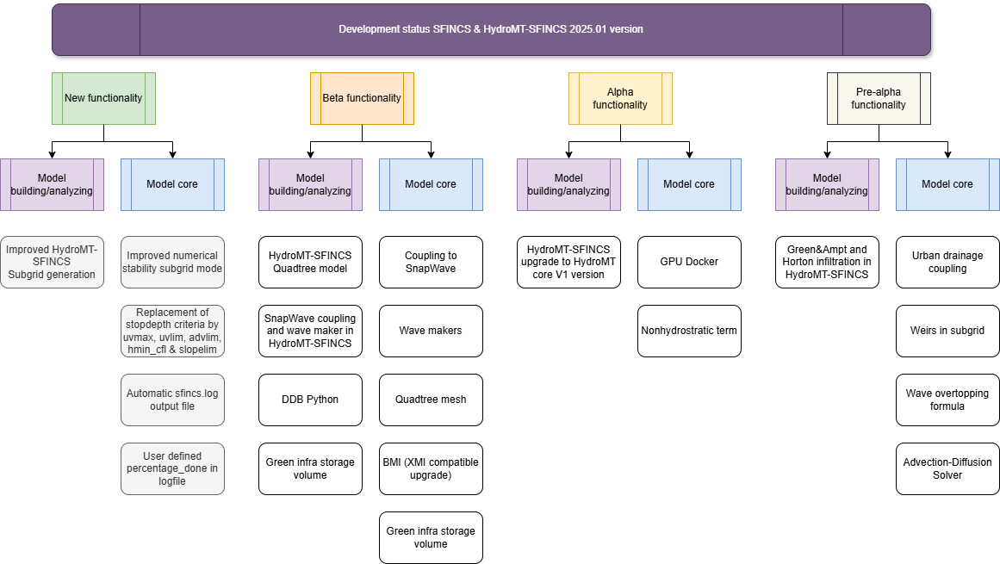
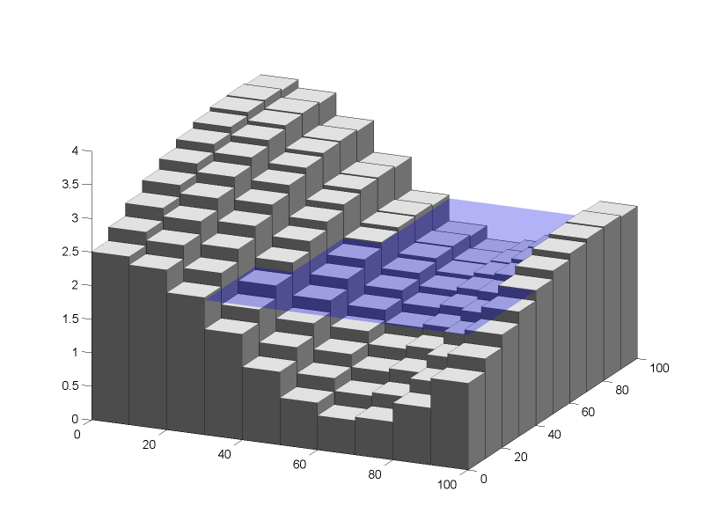

Developments
=====

SFINCS has continuely being developed since 2017, and many great features have been added over the years.
Hereby some examples regarding subgrid features and GPU computing.

Development status
-----

See here a schematic overview of the SFINCS development status at 2024 August, at the time of the v2.1.1 Dollerup release.
Indicated are new functionality for SFINCS itself (core), and model setup/post-processing using HydroMT-SFINCS and Delft Dashboard (Python).

   Overview of SFINCS development status 2024.01 Release

Known issues
-----

Known issues of the current SFINCS main version and last release are (improvements are work in progress):

* The BMI implementation in SFINCS is up to date with openearth/bmi-python, which is however not up to date with the latests CSDMS standard BMI implementation
* The combination of netspwfile with large difference in reference time between the spiderweb and the SFINCS simulation itself, might not run correctly in the Docker version. Use the ascii spwfile input or the Windows build executable which work correctly.

Releases Changelog
-----

Official open source version 2024.01: v2.1.1 Dollerup release
^^^^^

The first official 2024 release of SFINCS, the v2.1.1 Dollerup release, 'Conquering mountains in compound flood modelling two at a time', is now available!

This contains open access to the source code from Github: https://github.com/Deltares/SFINCS/releases/tag/v2.1.1_Dollerup_release.

As pre-compiled Windows executable:

https://download.deltares.nl/en/sfincs/

As Docker container:

docker pull deltares/sfincs-cpu:sfincs-v2.1.1-Dollerup-Release

Changes:

The code consists of all functionality of the v2.0.3 release, with the following major changes/additions:

Added functionality:

* New advection scheme 'advection_scheme = upw1' > new default! Old implementation still available as 'advection_scheme = original'.
* Option to include 2D component of friction term 'friction2d = true' > new default! Old implementation still available as 'friction2d = false'.
* New Python setup tools HydroMT-SFINCS release v1.1.0 > highly recommended to use this new version!
* New subgrid methodology including wet fraction as in Van Ormondt et al. (2024, in review), only available through net netcdf input file through new HydroMT-SFINCS version, recommended! Old implementation still available when providing the original binary file, then all wet fractions are assumed to be 1.
* Upgraded coupled and integrated stationary wave solver 'SnapWave' including Infragravity wave energy balance following Leijnse et al. (2024).
* New recommended default combination that with new advection scheme: alpha=0.50, theta=1.0, advection=1 (is now always 2D), viscosity=1.

Other changes:

* Improved stability for cell that from being dry becomes wet.
* Extra output variable to netcdf output files 'status', for easy checking whether a batch of simulations have all run succesfully: a value of 0 means no error
* Added option to specify in case of a 1 layer model (either quadtree input, or original input), whether you want the output as mesh quadtree netcdf (1), or regular gridded netcdf (0, default). Keyword: regular_output_on_mesh (0, default, =logical)
* netspwfile input for precipitation should be absolute atmospheric pressure, not the pressure drop.
* Upgrade Windows compiler to IFX 2024.
* Upgraded Netcdf version to newer native versions of Unidata: netCDF 4.9.2 & netcdf-fortran-4.6.1
* Updated documentation.
* Added tests in skillbed report.

Official open source version Q4 2023: v2.0.3 Cauberg release
^^^^^

The last official 2023 release of SFINCS for Q4, the v2.0.3 Cauberg release, 'Climbing hills of challenges in compound flood modelling', is now available!

This contains open access to the source code from Github: https://github.com/Deltares/SFINCS/releases/tag/v2.0.3_Cauberg_release.

As pre-compiled Windows executable:

https://download.deltares.nl/en/sfincs/

As Docker container:

docker pull deltares/sfincs-cpu:sfincs-v2.0.3-Cauberg

Changes:

The code consists of all functionality of the v2.0.2 release, with the following changes/additions:

Added functionality:

* Netcdf4 compliant output, for reduced file sizes
* Green & Ampt infiltration method
* Horton infiltration method
* Restartfiles including infiltration state, for the case of Curve Number with Recovery, Green&Ampt and Horton
* Netcdf Spiderweb input option
* Netcdf src+dis input option

Other changes:

* Improved culvert and drainage pipe formulations
* Updated documentation
* Added tests in skillbed report
* Compliance with new Python setup tools HydroMT-SFINCS release v1.0.2

Official open source version Q2 2023: v2.0.2 Blockhaus release
^^^^^

As the first out of 2 official 2023 releases, the v2.0.2 Blockhaus release, 'Smoothly cycling over challenges in compound flood modelling', is now available as Windows executable: https://download.deltares.nl/en/sfincs

And Docker container: docker pull deltares/sfincs-cpu:sfincs-v2.0.2-Blockhaus

This contains open access to the source code from Github: https://github.com/Deltares/SFINCS/releases/tag/v2.0.2.

The code consists of all functionality of the v2.0.0 release, with the following changes/additions:

* Potentially breaking change: flipped x&y coordinates in Netcdf map output to be Sgrid compliant. Note; might impact Matlab/Python post-processing scripts (fixed in new HydroMT-SFINCS release v1.1.0)
* Improved 2D component of advection scheme
* Option to not use rainfall in spiderweb, keyword:  usespwprecip = 0
* The x&y-coordinates of input weirfiles as snapped on grid internally in SFINCS are now written to the sfincs_his.nc file;  structure_x, structure_y & structure_height 
* Option to include viscosity, enabling running on theta=1.0,  with viscosity = 1. The values 'nuvisc' will be automatically determined based on your grid resolution, and written to the log screen. Value can still be overruled by specifying 'nuvisc = value' directly, or increased with e.g. a factor 2 using 'nuviscdim = 2'.
* Save maximum velocity proxy (in m/s) on 'dtmaxout'  interval:   storevelmax = 1
* Save maximum flux  (h * U in m^2/s) on 'dtmaxout'  interval:   storefluxmax = 1
* Save maximum discharge through drainage strucuture from 'drnfile' input on 'dthisout'  interval:   storeqdrain = 1
* Bugfix in weir formulation
* Updated documentation
* Added tests in skillbed report
* Compliance with new Python setup tools HydroMT-SFINCS release v1.0.1

Official open source version: v2.0.0 Alpe d'Huez release
^^^^^

On the 16th of November 2022, we have made SFINCS open source available as the SFINCS v2.0.0 Alpe d'Huez release, 'Moving Dutch Mountains in compound flood modelling'.
This contains open access to the source code and executables from Github: https://github.com/Deltares/SFINCS.
The code consists of all functionality of v1, with the large addition of the subgrid mode and first GPU functionality using openacc.
For more details, see below.

Pre-release version(s): v1 revision XXX
^^^^^

Before making SFINCS open source, version history was controlled using subversion numbering.
Therefore papers using pre-release versions of SFINCS for instance refer to 'trunk revision 141', as in Leijnse et al. 2021.
These version 1 revisions contained all standard SFINCS functionality for the regular mode.

Recent advancements in accuracy: subgrid mode
-----

What are subgrid features?
^^^^^
Subgrid features are a method in which flux computations are performed on a coarser grid than the update of the water levels which is done on a much finer resolution. 
In this way computations can be sped up, while still using high resolution information of topography and bathymetry.

   Example subgrid features within one grid cell

Why subgrid features?
^^^^^
Often model runtimes are too large to go to very fine resolution modelling because refining a grid size with a factor 2, leads to a 2^3 longer model runtime due to the time step limitation in the CFL-criteria. 
This can be overcome by using a subgrid approach for the continuity update. This has the benefit that larger grid domains can be used while keeping accurate results.

How does it work? 
^^^^^
The subgrid method implemented so that subgrid tables are derived in pre-processing that contain relations between the water level and volume for every grid cell. 
These tables are derived using high resolution topography and bathymetry data. 
In the SFINCS model itself, these subgrid tables are used to determine an accurate estimation of the water level after calculating fluxes on a coarser grid resolution. 
Additionally, for calculating the fluxes between cells, a representative water depth is determined.
The makes is possible to compute on a coarser grid resolution (improvement of efficiency) while still detailed information about the local elevation is incorporated when determining corresponding water levels leading to accurate results.

Increase in computational efficiency?
^^^^^
Due to this time step limitation, if one can calculate fluxes on a 200 m grid instead of a 100m grid, the computational speedup is a factor 8. 
Our case study in Houston shows that even larger increases in speed are possible!
See: https://agu2020fallmeeting-agu.ipostersessions.com/Default.aspx?s=9C-05-18-CF-F1-2B-17-F0-7A-21-93-E6-13-AE-F3-24

Recent advancements in speed: GPU enabled
-----
The SFINCS source code has now been GPU enabled to make optimal use of fast Graphics Processing Unit computers.
For more information get in touch with us!

