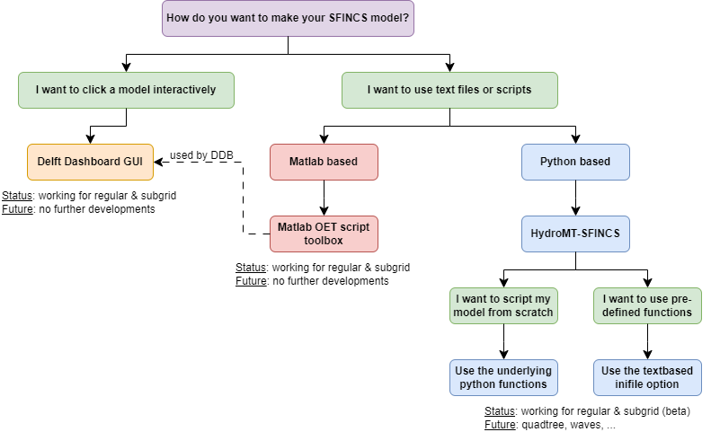

Setting up models
=====

Introduction 
-----

SFINCS models can be set up using simple ascii text and/or binary input files, which can be generated on whatever platform suiting you as a user best.
While SFINCS itself is coded in Fortran, it does not matter whether you create the input using a text editor, Matlab or Python.
To make the setting up of basic models easier, making a SFINCS model is supported by 3 open source available options:

* Graphical User Interface (GUI) to make SFINCS models interactively: **'Delft Dashboard'**
* Matlab scripts toolbox in the **'Open Earth Toolbox'**
* Command line/Python script framework called **'HydroMT'**, with its dedicated plugin **'hydromt_sfincs'**

If you need a more tailor-made solution for setting up your SFINCS models get in touch with us!

   Overview of input file of SFINCS with indication whther they are required or not		

Delft Dashboard 
-----

Delft Dashboard (Van Ormondt et al. 2020 https://doi.org/10.2166/hydro.2020.092) is a quick set-up tool GUI for hydrodynamic models that includes setting up SFINCS models.
The tool can be run on Matlab or as standalone executable and has all the basic functionality to setup your basic model using globally available DEMs in an interactive way.

For more information see: https://publicwiki.deltares.nl/display/DDB

Open Earth Tools
-----

In the Open Earth Tools a toolbox of Matlab scripts is included to have more flexibility in setting up your SFINCS models, that is also used by Delft Dashboard.
Throughout this User Manual examples of how to use these scripts are given in the code blocks '**Matlab example using OET**'.
For a general overview of possible input files and how to create them using Matlab scripts see: https://svn.oss.deltares.nl/repos/openearthtools/trunk/matlab/applications/sfincs/
For getting started with Open Earth Tools see: https://publicwiki.deltares.nl/display/OET/OpenEarth

HydroMT-SFINCS 
-----

HydroMT (Eilander et al. 2022 https://doi.org/10.5194/egusphere-2022-149) is a more recent addition to the tools available for setting up SFINCS models, and is a Python based command-line alternative.
Besides globally available DEMs it can also retrieve spatially varying infiltration and manning roughness data based on landuse maps.
Also, it is possible to burn in rivers or setup a offline coupled model together with the hydrological Wflow model that will provide boundary conditions as river discharge.

* For more information regarding the SFINCS plugin of HydroMT see: https://deltares.github.io/hydromt_sfincs/
* For more information regarding HydroMT in general see: https://deltares.github.io/hydromt/
* For more user flexibility, it is also possible now to access individual setup components to build your own model or forcing from scratch, see: https://deltares.github.io/hydromt_sfincs/latest/user_guide/sfincs.html
* For an example of building a model from scratch in Python see: https://deltares.github.io/hydromt_sfincs/latest/_examples/build_from_py.html

Executable
=====

We provide pre-compiled versions of SFINCS for you to use directly:

* Windows: https://download.deltares.nl/en/download/sfincs/  
* Platform independent through Docker (Windows/linux/singularity/HPC): https://hub.docker.com/r/deltares/sfincs-cpu 

Compiling yourself
=====

If you want to compile SFINCS yourself for windows to test certain improvements, you need Visual Studio and an Intel Fortran compiler.
Find here at tested and free available combination:

* Visual Studio Community 2022 - freely available from: https://visualstudio.microsoft.com/vs/community/
* Intel Fortran Compiler Classic and Intel Fortran Compiler for Windows* 2022.1.0 - freely available from: https://www.intel.com/content/www/us/en/developer/articles/tool/oneapi-standalone-components.html

After installation and configuring (see respective websites for help), you can compile your own SFINCS model locally and add features.
Make a checkout of the SFINCS github page, and open the VS solution file to do this: https://github.com/Deltares/SFINCS/blob/main/source/sfincs.sln

To collaborate together and under the GNU GPL-v3.0 license SFINCS comes with, share any improvements with us as pull request on Github: https://github.com/Deltares/SFINCS/pulls

Running SFINCS
=====

SFINCS can be run on multiple different platforms, both local, HPC and cloud based.
The simplest way is to run SFINCS on Windows using a batch-file.

On windows (standard)
-----

The standard method to run SFINCS locally is on a windows machine using a batch-file.
This batch file you copy to the folder where your input files to be used by SFINCS are located.
The batch file simply calls the executable (add the right path to the folder where sfincs.exe is located) and the general output text file is written to a new text file called 'sfincs_log.txt', see below for an example.

Using batch-file
^^^^^

**run.bat**

.. code-block:: text	
	
	make a text file called 'run.bat' and add here:
	
		call "c:\..\folder_where_exe_is_located\sfincs.exe">sfincs_log.txt	
	
On linux 
-----

Dedicated linux compiled version
^^^^^

Generally for Linux (HPC) systems, running using Docker or Singularity is the most generic and succesfull way.
In case you need a dedicated Linux build, get in touch and we can create a version specifically for you.
We have experience doing this for our own Deltares cluster.

Using Docker
-----

For always using the last build version of SFINCS on Windows, Mac, Linux or a cloud based cluster a convenient solution is running a Docker container version of SFINCS.
This can be done on a local desktop or in a cloud based cluster supporting docker (or using singularity, see below).

**Note that this Docker version of SFINCS is available under the same GNU GPL-v3 License as the windows executable.**

Local desktop version
^^^^^

After downloading Docker desktop for your operating system (https://www.docker.com/products/docker-desktop), you can run a model using:

**Example**

.. code-block:: text

	docker pull deltares/sfincs-cpu

	docker run -vC:/Users/../SFINCS:/data deltares/sfincs-cpu

	(here 'C:/Users/../SFINCS' is the folder where the SFINCS input files to be used are located)

Instead of using the latest automatically cmpiled version, you can also pull a verified tagged release from: https://hub.docker.com/r/deltares/sfincs-cpu/tags
This can be for instance the open source release version 'build-v0.0.1-2022-11-16'.

Cloud based cluster
^^^^^

The same principle is also possible on a cloud based cluster that supports running docker containers

Using Singularity
-----

On cloud based clusters like Surfsara/Azure/Amazon that **supports singularity**, it is possible to run the Docker container version of SFINCS directly.
Depending on the application it could be wise to pull the docker container once and save as new image, after which this image can be run multiple times.
This prevents unnesissarily loading the Docker container every time a simulation is performed.

**Note that this Docker version of SFINCS is available under the same GNU GPL-v3 License as the windows executable.**

**Example**

.. code-block:: text	
	
	Pulling and running the docker container immediately:
	
		singularity run -B$(pwd):/data --nv docker://deltares/sfincs-cpu

	
	First pulling the docker container and creating a singularity image, then running this image:
	
		singularity pull docker://deltares/sfincs-cpu sfincs-cpu.img

		singularity run -B$(pwd):/data sfincs-cpu.img
	
Also here, instead of using the latest automatically cmpiled version, you can also pull a verified tagged release from: https://hub.docker.com/r/deltares/sfincs-cpu/tags
This can be for instance the open source release version 'build-v0.0.1-2022-11-16'.

Courses learning SFINCS
=====

Besides the elaborate information available in this manual, we do offer courses to learn from the experts how to set up a SFINCS model, and the theory and philosophy behind the model:

* In person training during the Delft Software Days on November 16th, 2022, in Delft, the Netherlands: https://softwaredays.deltares.nl/-/compound-flooding-training

* SFINCS trainings during the DSD are planned to be regularly (yearly for now), for an up to date agenda see: https://softwaredays.deltares.nl/welcome

* Short couse on SFINCS during the Coastal Sediments conference April 11th, 2023, in New Orleans, USA: http://coastalsediments.cas.usf.edu/shortcourses.html

If these dates don't suit you or your organisation, or you want a more advanced training; get in touch and we can set up a tailor-made course for you.

Questions and support 
=====

As Deltares is a NGO project-based organisation, and while we do try to answer all your questions, we simply cannot do this to the ultimate end-degree-level as the model is provided to you free of charge.

If you do have more structurally returning questions about how to set up SFINCS models for your application, considering getting a Software Service Package.
For more information, send an email to: software@deltares.nl

Additionally, if you want the experts to set up a first working framework of SFINCS models for you, get in touch with product manager tim.leijnse@deltares.nl to discuss options for collaborations to set this up.

Contributing
=====

Documentation 
-----

The code of this documentation is available from https://github.com/Deltares/SFINCS/docs.
Get in touch if you have suggestions how to improve this manual, or put in a pull request with improvements yourself: https://github.com/Deltares/SFINCS/pulls

Code 
-----

The SFINCS code is open source as of 16-11-2022, see: https://github.com/Deltares/SFINCS/source

Get in touch if you would like to join us in developing the SFINCS code, or put in a pull request on Github with improvements yourself: https://github.com/Deltares/SFINCS/pulls

