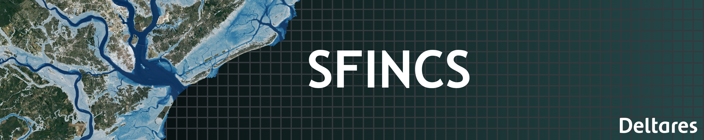

.. SFINCS documentation master file, created by
   sphinx-quickstart on Tue Jun 13 09:56:18 2017.
   You can adapt this file completely to your liking, but it should at least
   contain the root `toctree` directive.

Welcome to SFINCS's documentation!
======================================

**What is SFINCS?**

SFINCS is a super-fast open-source flood model developed at Deltares. 
It enables rapid simulation of storm surge, riverine (fluvial) flooding, rainfall-runoff (pluvial), and wave-driven flooding from national, regional to local scales. 
Designed to run in minutes instead of days, SFINCS supports scenario testing, operational forecasting, and climate adaptation planning worldwide. 

   
   
**Open source & licensing:** 

The SFINCS source code is released under the GNU GPL v3.0 license. You can: 

* Download pre-compiled executables (e.g. for Windows) under freeware license from the Deltares download portal: https://download.deltares.nl/sfincs 

* Access the full source code on GitHub and compile for your platform (Linux, HPC, etc.): https://github.com/Deltares/SFINCS

* Modify or extend the code, subject to GPL v3.0 terms. For more information on compiling, see the instructions in this manual under 'Getting started'. 
  
**Support & Services from Deltares:** 

While basic user help is provided free of charge, Deltares also offers structured Support Packages to help organizations get the most out of SFINCS. 
These packages (e.g. Basic and Advanced) include guaranteed support hours, faster response time, consulting and configuration help, model setup, etc. 
For more, see “Support Packages” or contact software@deltares.nl 

**Scientific Foundation and model adoptation:** 

SFINCS has been widely validated and applied in numerous scientific studies and practical applications worldwide.
The model has been adopted by both the scientific community, where the main SFINCS publications have reached 150+ citations and are listed below for reference.
SFINCS has also been adopted by practitioners for flood risk assessment, emergency planning, and climate adaptation strategies, with 1000+ downloads of the SFINCS executable and counting...

Key publications:

* Introduction and validation of SFINCS: Leijnse, T., van Ormondt, M., Nederhoff, C.M., van Dongeren, A. (2021). Modeling compound flooding in coastal systems using a computationally efficient reduced-physics solver: including fluvial, pluvial, tidal, wind- and wave-driven processes. Coastal Engineering, 165, 103852. DOI: 10.1016/j.coastaleng.2021.103852

* Introduces subgrid enhancements: van Ormondt, M., Leijnse, T., de Goede, R., Nederhoff, K., and van Dongeren, A. (2025). Subgrid corrections for the linear inertial equations of a compound flood model – a case study using SFINCS 2.1.1 Dollerup release, Geosci. Model Dev., 18, 843–861, https://doi.org/10.5194/gmd-18-843-2025

**Quick overview online manual:**

* For a background on SFINCS, application areas, performed international projects and publiscations, see "Introduction" in this manual.

* For a background on recent developments and new features in SFINCS, see "Developments" in this manual.

* For answers on pracatical steps to start using SFINCS, see "Getting started" in this manual.

* The main user manual section continues with guidance on model setup, input parameters, output formats, and advanced features such as compiling and customizing SFINCS. 

**More info and collaborating:**

* For more general information about SFINCS and Deltares, see: https://deltares.nl/en/software/sfincs/

* To collaborate or raise possible issues with the latest version of the model, see: https://github.com/Deltares/SFINCS/issues 

* To collaborate or raise possible issues with the Python model building tool HydroMT-SFINCS, see: https://github.com/Deltares/hydromt_sfincs/issues

**Contact:** 

Mail sfincs@deltares.nl for questions that are not answered yet by this documentation.
   
Acknowledgements
================

SFINCS is developed at Deltares and initiated by Maarten van Ormondt.
This documentation is developed and maintained by Tim Leijnse and Roel de Goede.
The SFINCS team also includes Koen van Asselt, Tycho Bovenschen, Ap van Dongeren, and Kees Nederhoff.

.. figure:: ./figures/SFINCS_logo.png
   :width: 300px
   :align: center

.. toctree::
   :maxdepth: 3
   :hidden:   
   :caption: Introduction:
   
   overview

.. toctree::
   :maxdepth: 3
   :hidden:   
   :caption: Developments:
   
   developments

.. toctree::
   :maxdepth: 3   
   :hidden:
   :caption: Getting started:
   
   example   

.. toctree::
   :maxdepth: 3
   :hidden:
   :caption: User manual:
   
   input
   input_forcing
   input_structures     

.. toctree::
   :maxdepth: 3   
   :hidden:
   :caption: Input parameters and files:
   
   parameters   

.. toctree::
   :maxdepth: 3   
   :hidden:
   :caption: Model output and messages:
   
   output   
