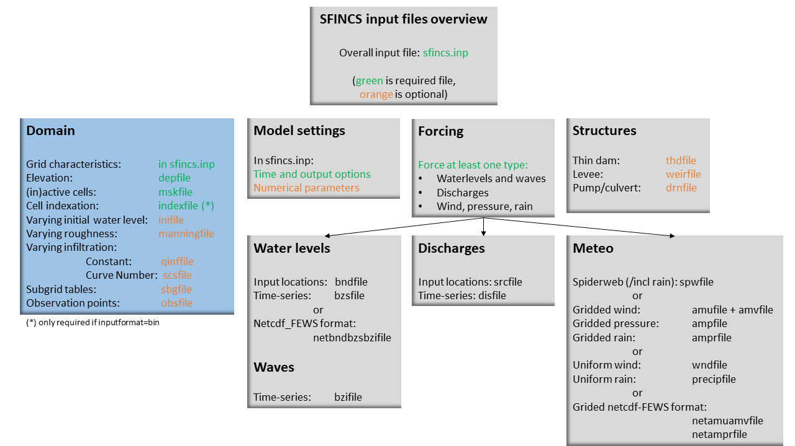
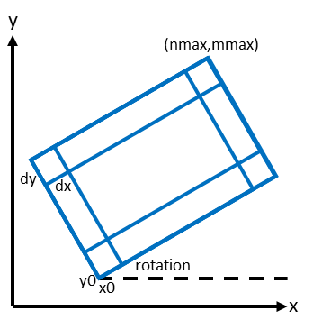
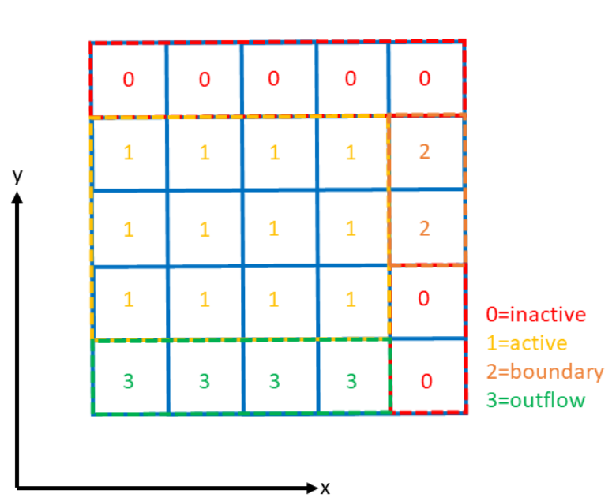
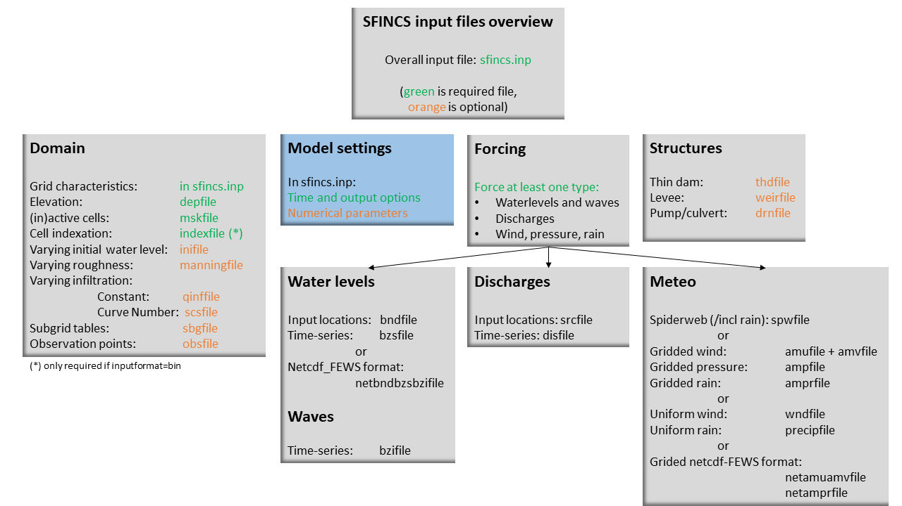

User manual - general
=====

Overview
-----

The input for SFINCS is supplied using various text and binary files, which are linked through the main input file: sfincs.inp.
Within this section of the input description all major input settings and files are discussed.
The figure below gives an overview of all different types of input files and whether they are required or not.
Below an example is given of this file, which uses a keyword/value layout. 
For more information regarding specific parameters see the pages 'Input parameters' or 'Output parameters'.

**NOTE - In the manual below, blocks named 'Matlab example using OET' are included, referring to easy setup scripts included in the SFINCS' Open Earth Tools Matlab set of scripts: https://svn.oss.deltares.nl/repos/openearthtools/trunk/matlab/applications/sfincs**

.. figure:: ./figures/SFINCS_documentation_figure1.png
   :width: 800px
   :align: center

   Overview of input file of SFINCS with indication whther they are required or not	
	
Example of sfincs.inp
-----

.. code-block:: text

	x0              = 0
	y0              = 0	
	mmax            = 100
	nmax            = 100
	dx              = 100
	dy              = 100
	rotation        = 0
	
	tref            = 20221116 000000
	tstart          = 20221116 180000
	tstop           = 20221116 235959
	
	depfile         = sfincs.dep
	mskfile         = sfincs.msk
	indexfile       = sfincs.ind

	bndfile         = sfincs.bnd
	bzsfile         = sfincs.bzs
	spwfile         = sfincs.spw
	srcfile         = sfincs.src
	disfile         = sfincs.dis

	advection	    = 0
	alpha           = 0.75
	huthresh	    = 0.05
	manning         = 0.04	
	theta 		    = 1.0
	qinf            = 0.0

	dtout           = 3600
	dtmaxout        = 86400	
	dthisout        = 600

	inputformat     = bin
	outputformat    = net	
	
	obsfile         = sfincs.obs  	

Domain
-----

To set up a SFINCS model a number of parameters and files need to be specified to define the domain of the location where a model is being set up for, see the figure below.
This consists of parameters of the grid characteristics in the main sfincs.inp-file and multiple separate input files.
Some of these are required (elevation, active cells, indexfile in case of binary files) and others are optional (roughness, infiltration, subgrid tables, observation points).

   
Grid characteristics
^^^^^

SFINCS uses a staggered equidistant recti-linear grid, grid sizes for x- a y-direction can be different. SFINCS can only be used in cartesian coordinates (e.g. UTM zone). 
The grid is initialised by stating an origin location of the cell edges (x0, y0), a number of grid cells in x-&y-direction (mmax, nmax) and the grid sizes in x-&y-direction (dx,dy).
If desired the grid can also be rotated using 'rotation', in degrees from the x-axis (east) in anti-clockwise direction.

   
.. code-block:: text
	
	e.g. in sfincs.inp:
	
	x0              = 0
	y0              = 0	
	mmax            = 250
	nmax            = 150
	dx              = 100
	dy              = 100
	rotation        = 45
	
**Matlab example using OET**

.. code-block:: text
	
	inp = sfincs_initialize_input;
	
	inp.x0              = 1000
	inp.y0              = 2000	
	
	sfincs_write_input('sfincs.inp',inp)

Depth file
^^^^^

To describe the local topography and bathymetry, elevation data has be supplied to the model.
This can be of any multiple of sources, but it is advised that the transition zone between different datasets and between above/below water level are checked with care.
The elevation is described in the cell centres of the grid.

The elevation is defined in sfincs.dep based on the specified grid, positive is upwards with respect to a certain reference level (topography has positive values, bathymetry has negative values).
The reference level is not known to SFINCS (and not relevant for the computation), so a user itself must be consistent in the use of specifying elevations in different files (elevation, initial water level, boundary conditions) always to the same vertical reference level (whether it is local MSL, NAP, EGM96 etc. etc.).

**NOTE - The depfile is not used when running SFINCS in the subgrid mode (see below)**

**depfile = sfincs.dep**

.. code-block:: text

	<zb x0,y0> <zb x1,y0> 

	<zb x0,y1> <zb x1,y1>

	e.g.
	2.0 	2.2
	1.8	2.4
	
**Matlab example using OET**

.. code-block:: text
	
	z = 5 * ones(nmax,mmax);
	msk = ones(nmax,mmax);
	
	% inputformat = bin:	
	sfincs_write_binary_inputs(z,msk,inp.indexfile,inp.depfile,inp.mskfile)

	% inputformat = asc:
	sfincs_write_ascii_inputs(z,msk,inp.depfile,inp.mskfile)
	
Mask file
^^^^^

To distinguish active from inactive areas and cells where boundary conditions need to be forced, a mask file needs to be supplied.
This mask indicates for every cell whether it is an inactive cell (msk=0), active cell (msk=1), boundary cell (msk=2) or outflow boundary cell msk=3).
This allows great flexibility in optimising the model domain and thereby reducing the computational runtime as much as possible.

If boundary water levels are supplied, these are only forced to the cells with a value of 2. 
Cells with a value of 0 are inactive and no fluxes from/to these cells are calculated.
The file can be made with the OET script 'sfincs_make_mask.m', whereby default a value of -2 m to MSL is used to distinguish the cells.

   Example of the different mask values on a grid.

**mskfile = sfincs.msk**

.. code-block:: text

	<msk (x0,y0)> <msk (x1,y0)>

	<msk (x0,y1)> <msk (x1,y1)>

	e.g.
	0 	1
	2	3
	
**Matlab example using OET**

.. code-block:: text
	
	z = 5 * ones(nmax,mmax);
	msk = ones(nmax,mmax);
	
	% inputformat = bin:	
	sfincs_write_binary_inputs(z,msk,inp.indexfile,inp.depfile,inp.mskfile)

	% inputformat = asc:
	sfincs_write_ascii_inputs(z,msk,inp.depfile,inp.mskfile)
	
Index file
^^^^^

Additionally a index file is needed when supplying binary input files (inputformat = bin).
This file is automatically generated when using the Matlab script sfincs_write_binary_inputs as in the example above.

**indexfile = sfincs.ind**

.. code-block:: text

	<cell number 1> <cell number 2> <cell number 3>

Subgrid tables
^^^^^

Currently the SFINCS model functionality has been extended so that SFINCS can also calculate flooding with the use of subgrid tables.
Hereby high-resolution elevation data is used to derive relations between the water level and the volume in a cell to do the continuity update, and a representative water depth used to calculate momentum fluxes.
The derivation of these subgrid tables is a pre-processing step outside of the model, that only needs to be done once!
The advantage of the subgrid version of SFINCS is that generally one can compute on coarsed grid sizes, while still having accurate results utilizing the high-resolution elevation data to its full potential.

Making subgrid tables is an advanced option that is only shown here as example using Matlab OET using the function 'sfincs_build_model.m'.
Get in touch with us to discuss the best solution to make subgrid features for your application (e.g. in Python).

The easiest way to make a SFINCS model using the subgrid functionality, is by using a recent version of the Delft Dashboard GUI.

After supplying a subgrid file so SFINCS (sbgfile = sfincs.sbg), SFINCS will automatically run in subgrid mode!

**Matlab example using OET**

	For more information see:
	https://svn.oss.deltares.nl/repos/openearthtools/trunk/matlab/applications/sfincs/sfincs_modelsetup/sfincs_build_model.m	

.. code-block:: text
	
	inp = sfincs_initialize_input;
	
	inp.sbgfile = sfincs.sbg;
	
	> change wanted grid settings dx/dy/mmax/nmax etc.
	inp.dx = 200;
	
	> define output folder; folder = 'c:\test\'
	
	> define bathymetry source from Delft Dashboard data source selection, e.g.; 
	bathy(1).name = 'ngdc_crm';
	bathy(1).zmin = 0;
	bathy(1).zmax = 10000;
	bathy(1).vertical_offset = 0;
	
	bathy(2).name = 'ngdc_crm';
	bathy(2).zmin = -10000;
	bathy(2).zmax = 0;
	bathy(2).vertical_offset = 0;	
	
	The first defined bathymetric source is always used first (given elevation constraints of 'zmin' and 'zmax'), after which the other sources are used in given hierarchy. 
	For types of possible data sources or adding your own one, see the Delft Dashboard manual: https://publicwiki.deltares.nl/display/DDB/Delft+Dashboard
	This elevation data is used to make the subgrid tables including relations between water level and volume within a cell (among others) using detailed elevation data on subgrid resolution.
	By default the subgrid cells are set to be 10 times smaller than the input dx/dy.
	
	> define wanted project coordinate reference system (UTM zone), e.g.; 
  	cs.name = 'WGS 84 / UTM zone 17N';
  	cs.type = 'projected';	
	
	sfincs_build_model(inp,folder,bathy,cs)

Friction
^^^^^

Different roughness values can great impact modelled flooding and thereby SFINCS allows the specification of a uniform value, differentiating land and sea with 2 different values or specifying a specific value per grid cell.

Friction is specified with a Manning roughness coefficient 'n' [s/m^{1/3}] and can be done spatially uniform, land/sea value based or spatially varying.

The following options are **ONLY** relavant for the **regular** version of SFINCS, in the subgrid version of SFINCS roughness is already included in the subgrid sbgfile and supplied additional keywords and files will **NOT** be used!

Spatially uniform:
%%%%%

Specify the keyword:

.. code-block:: text

	manning = 0.04 (default)

Land/sea value:
%%%%%

For spatially varying a reference level in meters 'rgh_lev_land' is used to distinguish land 'manning_land' (elevation > rgh_lev_land) and sea 'manning_sea' (elevation < rgh_lev_land) with different friction values.

.. code-block:: text

	rgh_lev_land = 0 (default) 

	manning_land = 0.04 

	manning_Sea = 0.02

Spatially varying:
%%%%%

For spatially varying friction values per cell use the manningfile option, with the same grid based input as the depfile using a binary file.

**manningfile = sfincs.man**

.. code-block:: text

	<manning x0,y0> <manning x1,y0> 

	<manning x0,y1> <manning x1,y1>

	e.g.
	0.02 	0.02
	0.06	0.04
	
**Matlab example using OET**

.. code-block:: text
	
	inp.manningfile = 'sfincs.man';
	
	manning = 0.02 * ones(nmax,mmax);
	msk = ones(nmax,mmax);
	
	sfincs_write_binary_inputs(manning,msk,inp.indexfile,inp.manningfile,inp.mskfile)
	
Infiltration
^^^^^

Infiltration can significantly alter the amount of flooding when including precipitation.
SFINCS allows the specification of a uniform constant value, spatially varying constant value or the Curve Number method.
The Curve Number is a generally used method to determine what parts of falling rainfall can infiltrate or will run-off, hereby a limited time component is taken into account as well.

Infiltration is specified with either constant in time values in mm/hr (both uniform and spatially varying), or using a Curve Number method (only spatially varying).

**NOTE - Infiltration in SFINCS is only turned on when any rainfall is forced'** 

**NOTE - Infiltration methods in SFINCS are not designed to be stacked**

Spatially uniform constant in time:
%%%%%

Specify the keyword:

.. code-block:: text

	qinf = 1.0
	
Spatially varying constant in time:
%%%%%

For spatially varying infiltration values per cell use the qinffile option, with the same grid based input as the depfile using a binary file.

**qinffile = sfincs.qinf**

.. code-block:: text

	<infiltrationrate x0,y0> <infiltrationrate x1,y0> 

	<infiltrationrate x0,y1> <infiltrationrate x1,y1>

	e.g.
	1.0 	5.0
	0.0	6.0

**Matlab example using OET**

.. code-block:: text
	
	inp.qinffile = 'sfincs.qinf';
	
	infiltration = 2.2 * ones(nmax,mmax);
	msk = ones(nmax,mmax);
	
	sfincs_write_binary_inputs(infiltration,msk,inp.indexfile,inp.qinffile,inp.mskfile)

Spatially varying Curve Number:
%%%%%

For spatially varying infiltration values per cell using the Curve Number method use the scsfile option, with the same grid based input as the depfile using a binary file.
Note here that in pre-processing the wanted CN values should be converted to S values following:

**S = (1000./CN - 10)**

There is also an advanced version of the Curve Number method that also allows for the recharge of soil capacity after time progresses.
Get it touch if you would like to know more information.

**scsfile = sfincs.scs**

.. code-block:: text

	<curve_number_value x0,y0> <curve_number_value x1,y0> 

	<curve_number_value x0,y1> <curve_number_value x1,y1>

	e.g.
	0 	10
	5	20
	
**Matlab example using OET**

.. code-block:: text
	
	CN_values = 50 * ones(nmax,mmax);
	S_values = (1000./CN - 10)
	msk = ones(nmax,mmax);
	
	sfincs_write_binary_inputs(S_values,msk,inp.indexfile,inp.scsfile,inp.mskfile)
	

Observation points
^^^^^

Observation points with water depth and water level output can be specified.
Per observation point as minimal the x-and y- coordinates are stated, an standard name will then be added per point.
Also, names of a station can be provided with quotes '' (maximum of 256 characters):

**obsfile = sfincs.obs**

.. code-block:: text

	<obs1 x1> <obs1 y1>  <obs1 'name1'>
	
	<obs2 x2> <obs2 y2>  <obs2 'name2'>

	e.g.:
	592727.98 2969420.51 'NOAA_8722548_PGABoulevardBridge,PalmBeach'
	594279.00 2961312.47 'NOAA_8722588_PortofWestPalmBeach'
 	595006.75 2944069.38 'NOAA_8722669_LakeWorthICW'
 	
**Matlab example using OET**

.. code-block:: text
	
	inp.obsfile = 'sfincs.obs';
	obs.x = [592727.98, 594279.00, 595006.75];
	obs.y = [2969420.51, 2961312.47, 2944069.38];
	obs.names = {'NOAA_8722548_PGABoulevardBridge,PalmBeach', 'NOAA_8722588_PortofWestPalmBeach', 'NOAA_8722669_LakeWorthICW'}; 
	
	sfincs_write_obsfile(inp.obsfile,obs)
	 	
Cross-sections for discharge output
^^^^^

Cross-sections for discharge output can be specified.
SFINCS will keep track of the discharge in m3/s flowing through the specified cross-section(s).
Per cross-section as minimal a name, the number of points (size data) and the x-and y- coordinates are stated, using the Delft3D 'tekal' format:

**crsfile = sfincs.crs**

.. code-block:: text

	NAME1 
	2 2 %size data
	<x0> <y0> %start of polyline 1
	<xend> <yend> %end of polyline 1
	
	NAME2 
	2 2 %size data
	<x0> <y0> %start of polyline 2
	<xend> <yend>  %end of polyline 1
	
	e.g.
	
	CRS01
	3 2
	0 100
	10 100
	20 100
	CRS02
	2 2
	20 200
	25 200	
	
**Matlab example using OET**

.. code-block:: text

	inp.crsfile = 'sfincs.crs';
	
	cross_sections(1).x = [0 10 20]; 
	cross_sections(1).y = [100 100 100]; 
	cross_sections(1).name = {'CRS01'};	
	cross_sections(2).x = [20 25]; 
	cross_sections(2).y = [200 200]; 
	cross_sections(2).name = {'CRS02'};
	cross_sections.length = length(cross_sections);
	
	sfincs_write_cross_sections(inp.crsfile,cross_sections);		
 	
Initial water level
^^^^^

The water level is by default initiated at 0 meters above mean water level, but can be changed.
In the initialisation phase within the model, all cells with an elevation below specified user value are given the specified value of 'zsini', thereby starting without a completely dry bed.
For more flexibility, this can also be prescribed spatially varying which can be relevant for coastal, riverine and tsunami cases.
This 'inifile' is now only supported using a **binary** file.

**NOTE - In pre-release versions of SFINCS this was an ascii type file**

Alternatively, you can specify initial conditions using a restart file, see below:

**zsini**

.. code-block:: text

	zsini = 1.0
	
**inifile = sfincs.ini**

.. code-block:: text

	<zsini_value x0,y0> <zsini_value x1,y0> 

	<zsini_value x0,y1> <zsini_value x1,y1>

	e.g.
	1.0 	1.2
	0.0	0.0
	
**Matlab example**

.. code-block:: text	

	inp.inifile = 'sfincs.ini';
	
	zini=zeros(inp.nmax, inp.mmax);
	zini(:,1:24+1)=0.6;       	
	sfincs_write_binary_inputs(zini,msk,inp.indexfile,inp.inifile,inp.mskfile)	

	
Restart file
^^^^^

In order to run SFINCS without spinup of water levels in a subsequent simulation, the waterlevels at the final time step of the former can be saved as binary-file using either the specification of a specific time you want to have the restartfile for (trstout = XXX seconds after 'tref'), or at a certain time internal (dtrstout = XXX seconds).
This restart file can then be specified as 'rstfile' in a subsequent SFINCS run, in order to start the simulation with the final water levels of the prior simulation.
This currently entails 'type 1', meaning both the water level, fluxes and mean velocities (1: zs, qx, qy, umean and vmean).

.. code-block:: text	

	> in the first SFINCS simulation specify:

	dtrstout 	= 86400 (restart output every 1 day)

	or:

	trstout     = 172800 (restart output 2 days after 'tref')

	> in the second SFINCS simulation specify:

	rstfile 	= ./simulation_01/sfincs.rst

Model settings
-----

   
Time management
^^^^^

The required model runtime can be specified by setting a reference date (tref), start date (tstart) and stop date (tstop). 
The format is 'yyyymmdd HHMMSS', see below:

.. code-block:: text

	tref 			= yyyymmdd HHMMSS
	tstart 			= yyyymmdd HHMMSS
	tstop 			= yyyymmdd HHMMSS
	
	e.g.
	tref            = 20180000 000000
	tstart          = 20180000 000000
	tstop           = 20180001 000000	

Also the output date interval can be controlled.
For the map output there is data output every 'dtout' seconds, for optional observation points this is 'dthisout' seconds.
It also possible to get the maximum output data over a specific interval (e.g. every day), specify using 'dtmaxout' in seconds.
When using a spiderweb-file for the wind input, the values are updated every 'dtwnd' seconds.

.. code-block:: text

	dtout 		= 3600
	dtmaxout 	= 86400
	dthisout 	= 600
	dtwnd 		= 1800

Input format 
^^^^^

The depth/mask/index-files can be binary or ASCII files. 
For the former specify 'inputformat = bin' (default), for the latter specify 'inputformat = asc'.

.. code-block:: text

	inputformat = bin

Output format
^^^^^

The main map output can be netcdf, binary or ASCII files. 
For the former specify 'outputformat = net' (default), for the others specify 'outputformat = bin' or 'outputformat = asc'.

.. code-block:: text

	outputformat = net

Output files
^^^^^

In case of netcdf output the map output will be named 'sfincs_map.nc', in case observation points are provided also a second file will be created with observation point output named 'sfincs_his.nc'.

For more information about the variables saved to the netcdf output files, see the 'Output description' section.

For binary or ascii files the output will be written to separate files, of which the named can be changed:

.. code-block:: text

	hmaxfile 	= hmax.dat
	zsfile 		= zs.dat
	vmaxfile 	= vmax.dat

Numerical parameters
^^^^^

**huthresh**

'huthresh' is the flow depth limiter in SFINCS, by default set to 0.05 meters, controlling what minimal water depth should be exceeded to call a cell wet, and start calculating fluxes.
It is recommended to use values within the range [0.001 <> 0.1].

**alpha**

'alpha' is the additional time step limiter besides the courant criteria.
By default this is set to 0.75, in case model simulations become instable for some reason this value can be reduced.
It is recommended to use values within the range [0.1 <> 0.75].

**theta**

'theta' sets the implicitness of the numerical scheme of SFINCS.
The default value is 1.0 which is recommended for the regular version of SFINCS, however if more smoothing in you model result is needed because it might become unstable for some reason, you could set this to theta=0.9..

**advection**

'advection' sets what version of the advection term to use in the momentum equation, varying between the default of no advection at all (advection = 0), 1D advection terms (advection = 1) and full 2D advection terms (advection = 2).
Generally it is only needed to turn on advection in case of modelling waves or super-critical flow.

.. code-block:: text

	huthresh 	= 0.05
	alpha 		= 0.75
	theta 		= 1.0
	advection 	= 0

**Drag Coefficients:**

The wind drag coefficients are varying with wind speed and implemented as in Delft3D. 
The default values are based on Vatvani et al. (2012). 
There is specified for how many points 'cd_nr' a velocity 'cd_wnd' and a drag coefficient 'cd_val' is specified, the following are the default values:

.. code-block:: text

	cd_nr 		= 3 

	cd_wnd 		= 0 28 50 

	cd_val 		= 0.0010 0.0025 0.0015 
	

