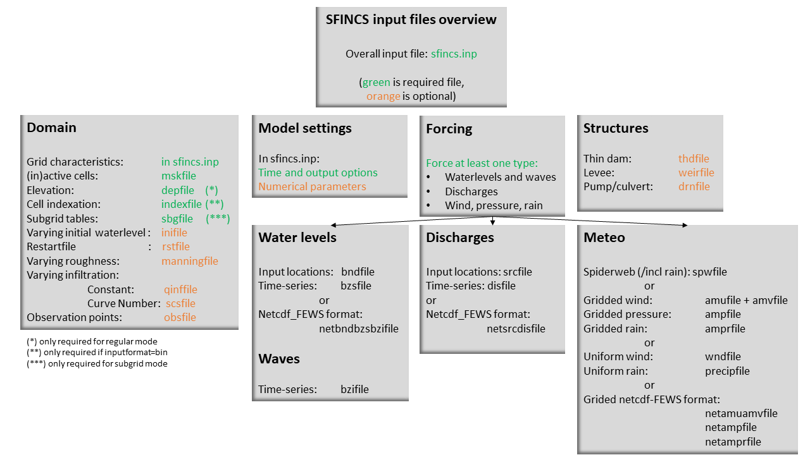
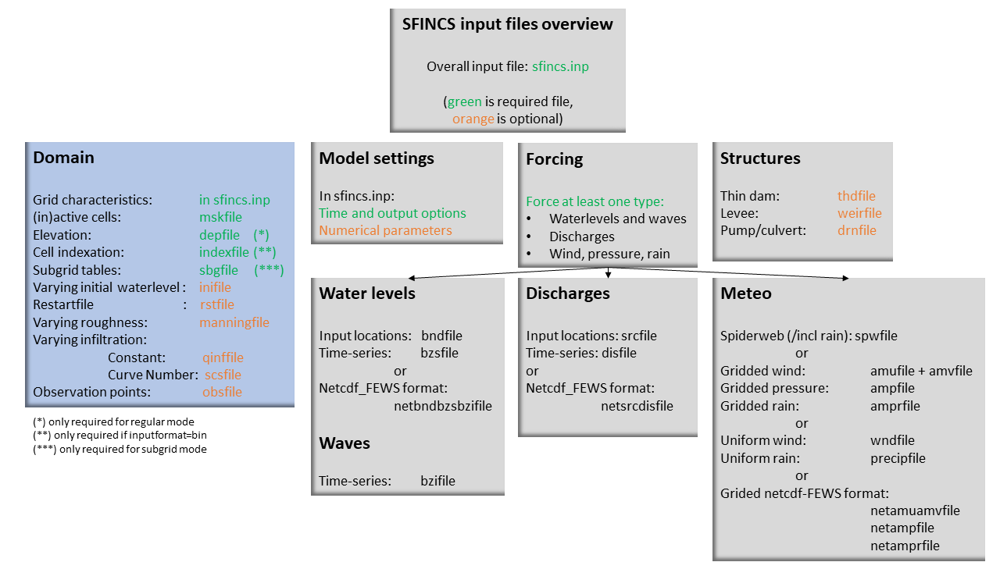

User manual - general
=====

Overview
-----

The input for SFINCS is supplied using various text (ascii), netcdf and binary files, which are linked through the main input file: sfincs.inp.
Within this section of the input description all major input settings and files are discussed.
The figure below gives an overview of all different types of input files and whether they are required or not.
Below an example is given of this file, which uses a keyword/value layout. 
For more information regarding specific parameters see the pages 'Input parameters' or 'Output parameters'.

**NOTE - In the manual below, blocks named 'Python example using HydroMT-SFINCS' are included, referring to easy setup functions of the HydroMT-SFINCS Python toolbox: https://deltares.github.io/hydromt_sfincs/latest/**

   Overview of input file of SFINCS with indication whther they are required or not	
	
Example of sfincs.inp
-----

.. code-block:: text

	x0              = 0
	y0              = 0	
	mmax            = 100
	nmax            = 100
	dx              = 100
	dy              = 100
	rotation        = 0
	
	tref            = 20221116 000000
	tstart          = 20221116 180000
	tstop           = 20221116 235959
	
	depfile         = sfincs.dep
	mskfile         = sfincs.msk
	indexfile       = sfincs.ind

	bndfile         = sfincs.bnd
	bzsfile         = sfincs.bzs
	spwfile         = sfincs.spw
	srcfile         = sfincs.src
	disfile         = sfincs.dis

	advection	= 1
	alpha           = 0.5
	huthresh	= 0.05
	manning         = 0.04	
	theta 		= 1.0
	qinf            = 0.0
        viscosity       = 1

	dtout           = 3600
	dtmaxout        = 86400	
	dthisout        = 600

	inputformat     = bin
	outputformat    = net	
	
	obsfile         = sfincs.obs  	

        storecumprcp    = 1
	storevelmax     = 1

**Python example using HydroMT-SFINCS**

.. code-block:: text
	
	sf.setup_config(
		**{
		"x0": 0,
		"y0": 0,
		"mmax": 250,
		"nmax": 150,
		"dx": 100,
		"dy": 100,
		"rotation": 45,
		"tref": "20090106 210000",
		"tstart": "20090106 210000",
		"tstop": "20090111 000000",
		"dtmaxout": 86400,
		"dtout": 3600,
		"obsfile": "sfincs.obs",
		}
	)	
	
	sf.write_config(config_fn: str = 'sfincs.inp')

	More information: 
	https://deltares.github.io/hydromt_sfincs/latest/api.html#setup-components
	https://deltares.github.io/hydromt_sfincs/latest/_examples/build_from_script.html	

Domain
-----

To set up a SFINCS model a number of parameters and files need to be specified to define the domain of the location where a model is being set up for, see the figure below.
This consists of parameters of the grid characteristics in the main sfincs.inp-file and multiple separate input files.
Some of these are required (elevation, active cells, indexfile in case of binary files) and others are optional (roughness, infiltration, subgrid tables, observation points).

   
Grid characteristics
^^^^^

SFINCS uses a staggered equidistant recti-linear grid, grid sizes for x- a y-direction can be different. SFINCS can only be used in cartesian coordinates (e.g. UTM zone). 
The grid is initialised by stating an origin location of the cell edges (x0, y0), a number of grid cells in x-&y-direction (mmax, nmax) and the grid sizes in x-&y-direction (dx,dy).
If desired the grid can also be rotated using 'rotation', in degrees from the x-axis (east) in anti-clockwise direction.

   
.. code-block:: text
	
	e.g. in sfincs.inp:
	
	x0              = 318650
	y0              = 5040000	
	dx              = 50
	dy              = 50	
	nmax            = 157
	mmax            = 250
	rotation        = 27
	epsg            = 32633
	
**Python example using HydroMT-SFINCS**

.. code-block:: text
	
	sf.setup_grid(
		x0=318650,
		y0=5040000,
		dx=50.0,
		dy=50.0,
		nmax=107,
		mmax=250,
		rotation=27,
		epsg=32633,
	)
	
	# Alternatively, we can also use a shape/geojson file to define the grid:

	sf.setup_grid_from_region(
		region = {'geom': 'data/region.geojson'},
		res= 50,
		rotated=True,
		crs=32633
	)

	More information: 
	https://deltares.github.io/hydromt_sfincs/latest/api.html#setup-components
	https://deltares.github.io/hydromt_sfincs/latest/_examples/build_from_script.html	

Depth file
^^^^^

To describe the local topography and bathymetry, elevation data has be supplied to the model.
This can be of any multiple of sources, but it is advised that the transition zone between different datasets and between above/below water level are checked with care.
The elevation is described in the cell centres of the grid.

The elevation is defined in sfincs.dep based on the specified grid, positive is upwards with respect to a certain reference level (topography has positive values, bathymetry has negative values).
The reference level is not known to SFINCS (and not relevant for the computation), so a user itself must be consistent in the use of specifying elevations in different files (elevation, initial water level, boundary conditions) always to the same vertical reference level (whether it is local MSL, NAP, EGM96 etc. etc.).

**NOTE - The depfile is not actively used when running SFINCS in the subgrid mode (see below)**

**depfile = sfincs.dep**

.. code-block:: text

	<zb x0,y0> <zb x1,y0> 

	<zb x0,y1> <zb x1,y1>

	e.g.
	2.0 	2.2
	1.8	2.4
	
**Python example using HydroMT-SFINCS**

.. code-block:: text
	
	# In this example we want to combine 2 elevation datasets, merit_hydro as elevation and gebco as bathymetry, in that order.

	datasets_dep = [{"elevtn": "merit_hydro", "zmin": 0.001}, {"elevtn": "gebco"}]

	# Add depth information to modelgrid based on these chosen datasets
	sf.setup_dep(datasets_dep=datasets_dep)

	More information: 
	https://deltares.github.io/hydromt_sfincs/latest/api.html#setup-components
	https://deltares.github.io/hydromt_sfincs/latest/_examples/build_from_script.html	
	
Mask file
^^^^^

To distinguish active from inactive areas and cells where boundary conditions need to be forced, a mask file needs to be supplied.
This mask indicates for every cell whether it is an inactive cell (msk=0), active cell (msk=1), boundary cell (msk=2) or outflow boundary cell msk=3).
Setting the value per cell allows great flexibility in optimising the model domain and thereby reducing the computational runtime as much as possible.
Cells with a value of 0 are inactive and no fluxes from/to these cells are calculated.
If boundary water levels are supplied, these are only forced to the cells with a value of 2. 
At outflow cells (msk=3), the water level is not forced, but water depth at that cell is artificially kept at zero (no water).
Cells with a value of 1 are normal active cells, where the water level is calculated and fluxes are calculated to/from these cells.
The file can be made with the HydroMT-SFINCS function 'setup_mask_active' to define what cells should be active.
And afterwards with the function 'setup_mask_bounds' to define of the active cells which ones are boundary or outflow cells.

   Example of the different mask values on a grid.

**mskfile = sfincs.msk**

.. code-block:: text

	<msk (x0,y0)> <msk (x1,y0)>

	<msk (x0,y1)> <msk (x1,y1)>

	e.g.
	0 	1
	2	3
	
**Python example using HydroMT-SFINCS**

.. code-block:: text
	
	# Choosing how to choose you active cells can be based on multiple criteria, here we only specify a minimum elevation of -5 meters
	sf.setup_mask_active(zmin=-5, reset_mask=True)

	# Here we add water level cells along the coastal boundary, for cells up to an elevation of -5 meters
	sf.setup_mask_bounds(btype="waterlevel", zmax=-5, reset_bounds=True)

	# Here we add outflow cells, only where clicked in shapefile along part of the lateral boundaries
	sf.setup_mask_bounds(btype="outflow", include_mask=gdf_include, reset_bounds=True)

	More information: 
	https://deltares.github.io/hydromt_sfincs/latest/api.html#setup-components
	https://deltares.github.io/hydromt_sfincs/latest/_examples/build_from_script.html	
	
Index file
^^^^^

Additionally a index file is needed when supplying binary input files (inputformat = bin).
This file is automatically generated when using the HydroMT-SFINCS function 'write'.

**indexfile = sfincs.ind**

.. code-block:: text

	<cell number 1> <cell number 2> <cell number 3>

Subgrid tables
^^^^^

The SFINCS model functionality has been extended so that SFINCS can also calculate flooding with the use of subgrid tables.
Hereby high-resolution elevation data is used to derive relations between the water level and the volume in a cell to do the continuity update, and a representative water depth used to calculate momentum fluxes.
The derivation of these subgrid tables is a pre-processing step outside of the model, that only needs to be done once!
The advantage of the subgrid version of SFINCS is that generally one can compute on coarsed grid sizes, while still having accurate results utilizing the high-resolution elevation data to its full potential.
Recommended Netcdf file input option available from SFINCS 2024.01 release onwards as in Van Ormondt et al. 2025, binary file option still possible for backwards compatability.

**Python example using HydroMT-SFINCS**

.. code-block:: text
	
	sf.setup_subgrid(
		datasets_dep=datasets_dep,
		datasets_rgh=datasets_rgh,
		datasets_riv=datasets_riv,
		nlevels=10,
		nr_subgrid_pixels=10,
		write_dep_tif=True,
		write_man_tif=True,
	)
	
	More information: 
	https://deltares.github.io/hydromt_sfincs/latest/api.html#setup-components
	https://deltares.github.io/hydromt_sfincs/latest/_examples/build_from_script.html	

Friction
^^^^^

Different roughness values can great impact modelled flooding and thereby SFINCS allows the specification of a uniform value, differentiating land and sea with 2 different values or specifying a specific value per grid cell.

Friction is specified with a Manning roughness coefficient 'n' [s/m^{1/3}] and can be done spatially uniform, land/sea value based or spatially varying.

The following options are **ONLY** relevant for the **regular** version of SFINCS, in the subgrid version of SFINCS roughness is already included in the generation of the subgrid sbgfile, see 'setup_subgrid', and supplied additional keywords and files will **NOT** be used!

Spatially uniform:
%%%%%

Specify the keyword:

.. code-block:: text

	manning = 0.04 (default)

Land/sea value:
%%%%%

For spatially varying a reference level in meters 'rgh_lev_land' is used to distinguish land 'manning_land' (elevation > rgh_lev_land) and sea 'manning_sea' (elevation < rgh_lev_land) with different friction values.

.. code-block:: text

	rgh_lev_land = 0 (default) 

	manning_land = 0.04 

	manning_Sea = 0.02

Spatially varying:
%%%%%

For spatially varying friction values per cell use the manningfile option, with the same grid based input as the depfile using a binary file.

**manningfile = sfincs.man**

.. code-block:: text

	<manning x0,y0> <manning x1,y0> 

	<manning x0,y1> <manning x1,y1>

	e.g.
	0.02 	0.02
	0.06	0.04
	
**Python example using HydroMT-SFINCS**

.. code-block:: text
	
	sf.setup_manning_roughness(
	    datasets_rgh=datasets_rgh,
	    manning_land=0.04,
	    manning_sea=0.02,
	    rgh_lev_land=0,  # the minimum elevation of the land
	)
	
	More information: 
	https://deltares.github.io/hydromt_sfincs/latest/api.html#setup-components
	https://deltares.github.io/hydromt_sfincs/latest/_examples/build_from_script.html
	
Infiltration
^^^^^

Infiltration processes play a critical role in flood mitigation as they determine the proportion of rainfall that is absorbed into the soil versus that which becomes surface runoff. The capacity of the ground to infiltrate rainwater is influenced by various factors such as soil type, vegetation cover, and land use, thereby directly influencing flood risk. If the infiltration capacity is exceeded during high-intensity rainfall events, the excess water may lead to rapid surface runoff and potential flooding, thus making it crucial to consider infiltration processes when modeling and predicting flood scenarios.

SFINCS allows the specification of the following options for accounting for infiltration:
1.	Uniform constant-in-time value
2.	Spatially varying constant -in-time value 
3.	The Curve Number method: empirical rainfall-runoff model 
4.	The Green-Ampt method: empirical rainfall-runoff model
5.	The Horton infiltration method

Infiltration is specified with either constant in time values in mm/hr (both uniform and spatially varying), or using more detailed parameters for the Curve Number method, The Green-Ampt method or Horton method.

**NOTE - Infiltration in SFINCS is only turned on when any rainfall is forced'** 

**NOTE - Infiltration methods in SFINCS are not designed to be stacked**

Spatially uniform constant in time:
%%%%%

Specify the keyword:

.. code-block:: text

	qinf = 1.0
	
**NOTE - To have some control that no infiltration is added an areas like the sea for this spatially uniform constant in time infiltration method, only infiltration is added to cells above a certain elevation above the bed level reference height**

**NOTE - By default this is set to 0, qinf_zmin = 0 (default), so below e.g. MSL, no infiltration is added**

Spatially varying constant in time:
%%%%%

For spatially varying infiltration values per cell use the qinffile option, with the same grid based input as the depfile using a binary file.

**qinffile = sfincs.qinf**

.. code-block:: text

	<infiltrationrate x0,y0> <infiltrationrate x1,y0> 

	<infiltrationrate x0,y1> <infiltrationrate x1,y1>

	e.g.
	1.0 	5.0
	0.0	6.0

**Python example using HydroMT-SFINCS**

.. code-block:: text
	
	sf.setup_constant_infiltration(
		qinf=None,
		lulc=None,
		reclass_table=None,
		reproj_method='average'
	)

	More information: 
	https://deltares.github.io/hydromt_sfincs/latest/api.html#setup-components

The Curve Number method:
%%%%%

The Curve Number (CN) method is a popular empirical procedure developed by the USDA Soil Conservation Service for estimating direct runoff volume and peak discharge rate from rainfall events. The method takes into account characteristics of the watershed, such as land use, soil type, and hydrologic conditions, expressed as a single 'Curve Number'. This CN is used to calculate a runoff coefficient, which is then used in determining the volume of runoff from a rainfall event. Within SFINCS, the options of the Curve Number method have been included: without recovery and without recovery during dry periods. Both are described in this manual.
In its classic form, the Curve Number model uses the following equation to relate total event runoff Q to total event precipitation P as follows:

**S = (1000./CN - 10)**

**Q = (P^2./(P+Smax)**

where Smax = the soil's maximum moisture storage capacity. Smax typically derived from a tabulated 'curve number' CN that varies with soil type and antecedent condition. It should be emphasized that these equations use units of inches while in SFINCS we apply the metric system. 

**Without recovery**

For spatially varying infiltration values per cell using the Curve Number method without recovery use the scsfile option, with the same grid based input as the depfile using a binary file. Note here that in pre-processing the wanted CN values should be converted to S values following:
* scsfile: maximum soil moisture storage capacity in inches

.. code-block:: text

	<curve_number_value x0,y0> <curve_number_value x1,y0> 

	<curve_number_value x0,y1> <curve_number_value x1,y1>

	e.g.
	0 	10
	5	20

**Python example using HydroMT-SFINCS**

.. code-block:: text
	
	sf.setup_cn_infiltration(
		"gcn250",
		antecedent_moisture="avg",
	)
	
	More information: 
	https://deltares.github.io/hydromt_sfincs/latest/api.html#setup-components
	https://deltares.github.io/hydromt_sfincs/latest/_examples/build_from_script.html

The user can also specify the sfacinf which control the initial abstraction or the amount of water before runoff, such as infiltration, or rainfall interception by vegetation; historically, it has generally been assumed that sfacinf = 0.2 (default, however, for urbanized watersheds lower values can be expected (e.g. 0.05). 

This option doesn't support restart functionality. 

**With recovery**

Within SFINCS, the Curve number method with recovery can be used as follows. The user needs to provide the following variables. For all variables, one needs to specify these values per cell with the same grid based input as the depfile using a binary file:

* smaxfile: maximum soil moisture storage capacity in m
* sefffile: soil moisture storage capacity at the start in m
* ksfile: saturated hydraulic conductivity in mm/hr

Using the saturated hydraulic conductivity, a recovery variables recovery constant (kr) and minimum recovery time before a new rainfall event occurs (hours) are computed similar to SWMM. 
The Curve Number has been implemented in hydromt-SFINCS. 
See https://deltares.github.io/hydromt_sfincs/latest/_generated/hydromt_sfincs.SfincsModel.setup_cn_infiltration_with_ks.html for more information.

This option does support restart functionality. 

**Python example using HydroMT-SFINCS**

.. code-block:: text
	
	sf.setup_cn_infiltration_with_ks(
		lulc="gcn250",
		hsg="hsg_NLCD",
		ksat="ksat_NLCD",
		reclass_table="reclass_NLCD",
		effective=0.50,
		block_size=2000
	)
	
	More information: 
	https://deltares.github.io/hydromt_sfincs/latest/api.html#setup-components

The Green-Ampt method:
%%%%%

The Green-Ampt method is a hydrological model extensively used to predict soil infiltration rates under ponded conditions, i.e., when water is freely available on the surface. This method considers important parameters such as initial soil moisture content, hydraulic conductivity, and soil capillary suction head. 

The basic form of the Green-Ampt equation is expressed as follows: 

**f(t) = K(1+ delta_theta (sigma + h0) / F(t) )**

In which t is time, K is the saturated hydraulic conductivity, delta_theta is defined as the soil capacity (the difference between the saturated and initial moisture content) and sigma is the soil suction head.

Within SFINCS, the Green-Ampt method can be used as follows. The user needs to provide the following variables. For a range of typically values see Table 1. For all variables, one needs to specify these values per cell with the same grid based input as the depfile using a binary file:

* ksfile: saturated hydraulic conductivity in mm/hr
* sigmafile: soil moisture deficit in [-]
* psifile: suction head at the wetting front in mm

Using the saturated hydraulic conductivity, recovery variables such as the moisture deficit recovery constant (kr), depth of upper soil recovery zone (Lu) and minimum recovery time before a new rainfall event occurs (hours) are computed similar to SWMM. The Green-Ampt method has not been implemented yet in hydromt-SFINCS. 

This option does support restart functionality. 

The Horton method:
%%%%%

The Horton Method is a conceptual approach used primarily in hydrology to model the rate of infiltration of water into the soil. This method was developed by Robert E. Horton in 1939, and it is foundational in the field of hydrology.

According to the Horton Method, initially, the infiltration capacity is high, but it decreases exponentially over time until it reaches a stable, steady-state value, known as the final infiltration rate. This phenomenon occurs due to the gradual saturation of the soil, and the reduction in infiltration rate continues until it equals the soil's hydraulic conductivity.

The basic form of the Horton equation is expressed as follows: 

**f_t = f_c + (f_0 - f_c) e^{-kt}**

In which f_t is the infiltration rate at time, f_c is the final, constant infiltration rate, f_0 is the initial infiltration rate, k is a decay constant and t is the time since the start of infiltration.

Within SFINCS, the Horton method can be used as follows. The user needs to provide the following variables. For all variables, one needs to specify these values per cell with the same grid based input as the depfile using a binary file:

* f0file: maximum (Initial) Infiltration Capacity in mm/hr
* fcfile: Minimum (Asymptotic) Infiltration Rate in mm/hr
* kdfile: empirical constant (hr-1) of decay

The recovery of the infiltration rate during dry weather (kr) is calculated as factor of the empirical decay constant. By default, this keyword (horton_kr_kd) is set to 10.0 meaning that the recovery goes 10 times as slow as the decay.

This option also supports restart functionality. 

Storage volume
^^^^^

Storage volume for green infrastructure on the 2D grid, specifies the maximum storage volume of water per grid cell in cubic meters.
Water will be stored in this storage volume before it will contribute to surface runoff.

**NOTE - Only useable in subgrid mode **

**volfile = sfincs.vol**

.. code-block:: text

	<vol_value x0,y0> <vol_value x1,y0> 

	<vol_value x0,y1> <vol_value x1,y1>

	e.g.
	1.0 1.2
	0.0	0.0
 	
**Python example using HydroMT-SFINCS**

.. code-block:: text
	
	sf.setup_storage_volume(
		storage_locs="storage_locs.geojson",
		volume: 1000.0,
		height: None,
		merge=True
	)
	
	More information: 
	https://deltares.github.io/hydromt_sfincs/latest/_generated/hydromt_sfincs.SfincsModel.setup_storage_volume.html

Observation points
^^^^^

Observation points with water depth and water level output can be specified.
Per observation point as minimal the x-and y- coordinates are stated, an standard name will then be added per point.
Also, names of a station can be provided with quotes '' (maximum of 256 characters):

**obsfile = sfincs.obs**

.. code-block:: text

	<obs1 x1> <obs1 y1>  <obs1 'name1'>
	
	<obs2 x2> <obs2 y2>  <obs2 'name2'>

	e.g.:
	592727.98 2969420.51 'NOAA_8722548_PGABoulevardBridge,PalmBeach'
	594279.00 2961312.47 'NOAA_8722588_PortofWestPalmBeach'
 	595006.75 2944069.38 'NOAA_8722669_LakeWorthICW'
 	
**Python example using HydroMT-SFINCS**

.. code-block:: text
	
	sf.setup_observation_points(
		locations="observation_points.geojson",
		merge=True
	)
	
	More information: 
	https://deltares.github.io/hydromt_sfincs/latest/api.html#setup-components
	https://deltares.github.io/hydromt_sfincs/latest/_examples/build_from_script.html

Cross-sections for discharge output
^^^^^

Cross-sections to get the discharge flowing through as output can be specified.
SFINCS will keep track of the discharge in m3/s flowing through the specified cross-section(s).
Per cross-section as minimal a name, the number of points (size data) and the x-and y- coordinates are stated, using the Delft3D 'tekal' format.
You can specify more than 2 points per cross-section.

The output is available as 'crosssection_discharge' in sfincs_his.nc, see the description in "Output description".

**crsfile = sfincs.crs**

.. code-block:: text

	NAME1 
	2 2 %size data
	<x0> <y0> %start of polyline 1
	<xend> <yend> %end of polyline 1
	
	NAME2 
	2 2 %size data
	<x0> <y0> %start of polyline 2
	<xend> <yend>  %end of polyline 1
	
	e.g.
	
	CRS01
	3 2
	0 100
	10 100
	20 100
	CRS02
	2 2
	20 200
	25 200	
	
**Python example using HydroMT-SFINCS**

.. code-block:: text

	sf.setup_observation_lines(
		locations="observation_lines.geojson",
		merge=True
	)
	
	More information: 
	https://deltares.github.io/hydromt_sfincs/latest/api.html#setup-components
	https://deltares.github.io/hydromt_sfincs/latest/_examples/build_from_script.html

Initial water level
^^^^^

The water level is by default initiated at 0 meters above mean water level, but can be changed.
In the initialisation phase within the model, all cells with an elevation below specified user value are given the specified value of 'zsini', thereby starting without a completely dry bed.
For more flexibility, this can also be prescribed spatially varying which can be relevant for coastal, riverine and tsunami cases.
This 'inifile' is now only supported using a **binary** file.

**NOTE - In pre-release versions of SFINCS this was an ascii type file**

Alternatively, you can specify initial conditions using a restart file, see below:

**zsini**

.. code-block:: text

	zsini = 1.0
	
**inifile = sfincs.ini**

.. code-block:: text

	<zsini_value x0,y0> <zsini_value x1,y0> 

	<zsini_value x0,y1> <zsini_value x1,y1>

	e.g.
	1.0 	1.2
	0.0	0.0
	
Restart file
^^^^^

In order to run SFINCS without spinup of water levels in a subsequent simulation, the waterlevels at the final time step of the former can be saved as binary-file using either the specification of a specific time you want to have the restartfile for (trstout = XXX seconds after 'tref'), or at a certain time internal (dtrstout = XXX seconds).
This restart file can then be specified as 'rstfile' in a subsequent SFINCS run, in order to start the simulation with the final water levels of the prior simulation.
This currently entails 'type 1', meaning both the water level, fluxes and mean velocities (1: zs, qx, qy, umean and vmean).

.. code-block:: text	

	> in the first SFINCS simulation specify:

	dtrstout 	= 86400 (restart output every 1 day)

	or:

	trstout     = 172800 (restart output 2 days after 'tref')

	> in the second SFINCS simulation specify:

	rstfile 	= ./simulation_01/sfincs.rst

Model settings
-----

.. figure:: ./figures/SFINCS_documentation_modelsettings.png
   :width: 800px
   :align: center
   
Time management
^^^^^

The required model runtime can be specified by setting a reference date (tref), start date (tstart) and stop date (tstop). 
The format is 'yyyymmdd HHMMSS', see below:

.. code-block:: text

	tref 			= yyyymmdd HHMMSS
	tstart 			= yyyymmdd HHMMSS
	tstop 			= yyyymmdd HHMMSS
	
	e.g.
	tref            = 20180000 000000
	tstart          = 20180000 000000
	tstop           = 20180001 000000	

Also the output date interval can be controlled.
For the map output there is data output every 'dtout' seconds, for optional observation points this is 'dthisout' seconds.
It also possible to get the maximum output data over a specific interval (e.g. every day), specify using 'dtmaxout' in seconds.
When using a spiderweb-file for the wind input, the values are updated every 'dtwnd' seconds.

.. code-block:: text

	dtout 		= 3600
	dtmaxout 	= 86400
	dthisout 	= 600
	dtwnd 		= 1800

Input format 
^^^^^

The depth/mask/index-files can be binary or ASCII files. 
For the former specify 'inputformat = bin' (default), for the latter specify 'inputformat = asc'.

.. code-block:: text

	inputformat = bin

Output format
^^^^^

The main map output can be netcdf, binary or ASCII files. 
For the former specify 'outputformat = net' (default), for the others specify 'outputformat = bin' or 'outputformat = asc'.

.. code-block:: text

	outputformat = net

Output files
^^^^^

In case of netcdf output the map output will be named 'sfincs_map.nc', in case observation points are provided also a second file will be created with observation point output named 'sfincs_his.nc'.

For more information about the variables saved to the netcdf output files, see the 'Output description' section.

Numerical parameters
^^^^^

For more options, see the tab 'Input parameters'.

**huthresh**

'huthresh' is the flow depth limiter in SFINCS, by default set to 0.05 meters, controlling what minimal water depth should be exceeded to call a cell wet, and start calculating fluxes.
It is recommended to use values within the range [0.001 <> 0.1].

**alpha**

'alpha' is the additional time step limiter besides the courant criteria.
By default this is set to 0.5, in case model simulations become instable for some reason this value can be reduced.
It is recommended to use values within the range [0.1 <> 0.75].

**theta**

'theta' sets the implicitness of the numerical scheme of SFINCS.
The default value is 1.0 which is recommended for the regular version of SFINCS, however if more smoothing in you model result is needed because it might become unstable for some reason, you could set this to theta=0.9.

**advection**

'advection' sets whether to turn on or off the advection term used in the momentum equation, varying between the default of turned on (advection = 1, default), or off (advection = 0).
Recommended is to turn the advection term always on.

'advection_scheme' selects the advection scheme option. It is possible to select the new (2024.01 release) advection scheme using 'advection_scheme = upw1' = default, or the original implementation from Leijnse et al. (2021) can be selected as 'advection_scheme = original' for backwards compatability.  NOTE - from SFINCS 2024.01 release onwards.

'advlim' sets the possibility to limit the advection term in the momentum equation for increased stability, default is set to 1 (2025.01 release onwards).

.. code-block:: text

	huthresh 	= 0.05
	alpha 		= 0.5
	theta 		= 1.0
	advection 	= 1

**friction2d**

'friction2d' sets whether to include the 2D component for determining the friction term or not (default = true). Original implementation from Leijnse et al. (2021) can be selected as 'friction2d = false' for backwards compatability. NOTE - from SFINCS 2024.01 release onwards.

**viscosity**

'viscosity' turns on the viscosity term in the momentum equation (viscosity = 1).
The recommended value of 'nuvisc', the viscosity coefficient 'per meter of grid cell length' to add to your model is 0.01.
This coefficient is multiplied internally with the grid cell size (per quadtree level in quadtree mesh mode).
For ease, this is displayed when running the model:	'Viscosity - nuvisc=   [0.1000000 - 0.5000000]'. 
Increasing the value of 'nuvisc' increases the viscosity term and effectively internal smoothing of the flow.
	
**NOTE - It is recommended to EITHER have smoothing using viscosity=1 OR through numerical smoothing with theta<1.0 BUT NOT BOTH**

.. code-block:: text

	viscosity 	= 1
	nuvisc 		= 0.01

	nuviscdim 	= Depricated after Cauberg release of SFINCS.
	
**Drag Coefficients:**

The wind drag coefficients are varying with wind speed and implemented as in Delft3D. 
The default values are based on Vatvani et al. (2012). 
There is specified for how many points 'cd_nr' a velocity 'cd_wnd' and a drag coefficient 'cd_val' is specified, the following are the default values:

.. code-block:: text

	cd_nr 		= 3 

	cd_wnd 		= 0 28 50 

	cd_val 		= 0.0010 0.0025 0.0015 
	

