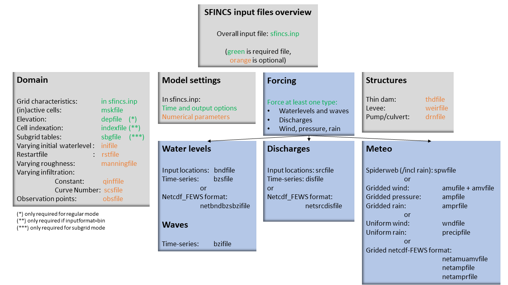
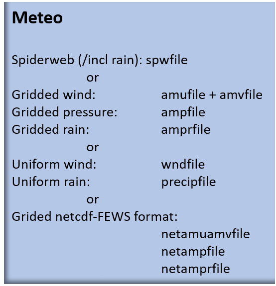

User manual - forcing
=======

Overview
----------------------

The input for SFINCS is supplied using various text and binary files, which are linked through the main input file: sfincs.inp.
Within this section of the user manual all different types of forcing settings and files are discussed.
The figure below gives an overview of all different types of input files and whether they are required or not.
Below an example is given of this file, which uses a keyword/value layout. 
For more information regarding specific parameters see the pages 'Input parameters' or 'Output parameters'.

**NOTE - In the manual below, blocks named 'Python example using HydroMT-SFINCS' are included, referring to easy setup functions of the HydroMT-SFINCS Python toolbox: https://deltares.github.io/hydromt_sfincs/latest/**

   Overview of input file of SFINCS with indication whther they are required or not

Forcing
^^^^^^^^^
SFINCS has different functionalities regarding different relevant physical processes for compound flooding and what type of model is required. 
At first nearshore/offshore water levels can be specified at the different locations along the coast to include tides and storm surge levels. 
Inland drivers of flooding like precipitation and wind can be specified in a number of ways.  
This varies from simple spatially uniform time-series to spatially varying spiderwebs or grid input types.  
Furthermore, simple implementations for discharges are included.

Discussed in this user manual are the water-level boundaries, discharge points, wind, pressure, rain and waves.

Water levels
----------------------

To specify water-level time-series to the boundary cells (msk=2), first the input locations have to be specified in 'sfincs.bnd'.
For every boundary point there is interpolated with a weighted average between the two closest input locations.

   Example of the weighted interpolation of boundary input locations to the msk=2 boundary cells.

Water level points
^^^^^^^^^

**bndfile = sfincs.bnd**

.. code-block:: text

	<bnd1 x1> <bnd1 y1>  
	
	<bnd2 x2> <bnd2 y2>  

	e.g.
	400000 	1200000
	480000 	1250000
	
Water level time-series
^^^^^^^^^

Then in the file 'sfincs.bzs' the water level time-series are specified per input location.
Times are specified in seconds with respect to SFINCS' internal reference time 'tref', as specified in sfincs.inp.

**NOTE - The time and length of values you prescibe per boundary input location should be all the same in the bzsfile**

**bzsfile = sfincs.bzs**

.. code-block:: text

	<time 1> <zs1 bnd1> <zs1 bnd2>

	<time 2> <zs2 bnd1> <zs2 bnd2>
	
	e.g.
	0 	0.50	0.75
	3600 	0.60	0.80
	7200 	0.45	0.85
	
**Python example using HydroMT-SFINCS**

.. code-block:: text

	NOTE - The python function both creates the bnd and bzs file, so you don't need to create them separately.
	
	sf.setup_waterlevel_forcing(
		geodataset=None,
		timeseries=None, 
		locations=None,
		offset=None,
		buffer=None,
		merge=True,
	)
	
	More information: 
	https://deltares.github.io/hydromt_sfincs/latest/api.html#setup-components
	https://deltares.github.io/hydromt_sfincs/latest/_examples/build_from_script.html
	
Waves
----------------------

When forcing waves, besides providing a bzsfile with slowly varying water level time-series, also the same type of file with the quickly varying water level component due to waves can be prescribed as bzifile.
This can contain infragravity and/or short waves.
Do note that the forced signal should be the incoming wave component only, not including the reflecting one, since this is computed by SFINCS internally as well.
The signal should be around 0.

**NOTE - Specified time should be the same in both the bzs and bzi files - generally on a high frequency of seconds**

**NOTE - There is not a specific Python function yet, but one could call the setup_waterlevel_forcing function twice with saving the files in between and changing their names**

**bzifile = sfincs.bzi**

.. code-block:: text

	<time 1> <zi1 bnd1> <zi1 bnd2>

	<time 2> <zi2 bnd1> <zi2 bnd2>
	
	e.g.
	0 	0.05	0.07
	2 	-0.02	-0.04
	4 	0.10	0.03
	
Netcdf format input
^^^^^^^^^

As alternative, the bnd/bzs/bzi data can also be specified using a single Netcdf file with FEWS input type format 'netbndbzsbzifile'.
SFINCS assumes that the input variables 'x', 'y', 'time', 'zs' (needed, for bzsfile equivalent), 'zi' (optional, for bzifile equivalant) and 'stations' are available in the netcdf file, including a reference time as UNIT in variable 'time' of the Fews time format: "minutes since 1970-01-01 00:00:00.0 +0000"  

**NOTE - There is not a specific Python function for this yet**
	
Discharges
---------

A simple implementation of discharge points is added to SFINCS, specify values in m^3/s. 
First specify the locations in 'sfincs.src' and then the discharge time-series in 'sfincs.dis'.
Alternatively, you can provide this as netcdf file in the Delft-FEWS format.

   
   Example of how discharge input points from 2 different sources are snapped to the grid of SFINCS.

Discharge points
^^^^^^^^^   

**srcfile = sfincs.src**

.. code-block:: text

	<src1 x1> <src1 y1>  
	
	<src2 x2> <src2 y2>  

	e.g.
	300000 	1500000
	380000 	1650000

Discharge time-series
^^^^^^^^^

Then in the file 'sfincs.dis' the discharge time-series are specified per input location.
Times are specified in seconds with respect to SFINCS' internal reference time 'tref', as specified in sfincs.inp.

**disfile = sfincs.dis**

.. code-block:: text
	
	<time 1> <dis1 src1> <dis1 src2>

	<time 2> <dis2 src1> <dis2 src2>

	e.g.
	0 	100	1000
	3600 	300	1100
	7200 	0	1300
	
**Python example using HydroMT-SFINCS**

.. code-block:: text

	NOTE - The python function both creates the src and dis file, so you don't need to create them separately.
	
	sf.setup_discharge_forcing(
		geodataset=None,
		timeseries=None, 
		locations=None,
		merge=True,
		buffer=None,
	)
	
	OR by subtracting results from a 2D hydrological model output like wflow (https://www.deltares.nl/en/software-and-data/products/wflow-catchment-hydrology):

	sf.setup_discharge_forcing_from_grid(
		discharge=None,
		locations=None,
	)

	More information: 
	https://deltares.github.io/hydromt_sfincs/latest/api.html#setup-components
	https://deltares.github.io/hydromt_sfincs/latest/_examples/build_from_script.html
	
Netcdf format input
^^^^^^^^^

As alternative, the src/dis data can also be specified using a single Netcdf file with FEWS input type format 'netsrcdisfile'.
SFINCS assumes that the input variables 'x', 'y', 'time', 'discharge' and 'stations' are available in the netcdf file, including a reference time as UNIT in variable 'time' of the Fews time format: "minutes since 1970-01-01 00:00:00.0 +0000"  

**NOTE - There is not a specific Python function for this yet**
	
Meteo
---------

There are a few different options to specify wind and rain input: 

1) Use a spatially varying input in a polar coordinate system ('spiderweb'; as in Delft3D/Delft3D FM) for forcing tropical cyclones for wind and pressure input only, or also for rainfal. 

2) Use a spatially varying grid input (as in Delft3D) for u- and v- wind velocities and/or the rain and/or pressure input.

3) Use a spatially varying grid input using a netcdf file based on a FEWS input type format for wind, rain, and/or atmospheric pressure input.

4) Use a spatially uniform input for wind and rain, which is faster but also more simplified.

5) Make a combination, for instance use a spiderweb for the wind input and a spatially uniform rain-input. When combining, test whether the forcing is as wanted since not all combinations of the above options might be possible and/or changing depending on specific code version.

**NOTE - ampr_block - keyword controlling whether the input precipitation rate is kept constant for the duration of the input time interval (block interpolation, ampr_block = 1, default), or whether it is interpolated linearly in time (ampr_block = 0).**

**NOTE - You can know how much rainfall / wind is added to the model in the output by specifying 'storecumprcp=1' and/or 'storemeteo=1', see the description in "Input parameters".**

   Overview of possible meteo input file options and names

Spatially varying spiderweb
^^^^^^^^^

The option of forcing spiderweb files is only relevant for tropical cyclones, as these time and spatially varying wind fields are constructed and written in a polar coordinate system.
For generation of these spiderweb files use Deltares' Wind Enhancement Scheme tool (WES, see https://content.oss.deltares.nl/delft3d/manuals/Delft3D-WES_User_Manual.pdf, OET Matlab equivalent, the Coastal Hazards Toolkit or other methods). If you have issues with the generation of a spiderweb, feel free to get in touch.
There are two options for spatially varying spiderweb. There is the 'traditional' ASCII format and the netcdf option. Both options support the possibility to include rainfall too.

**Spiderweb-input-ascii:**

.. code-block:: text

	spwfile = tropical_cyclone.spw

**Spiderweb-input-netcdf:**

.. code-block:: text

	netspwfile = tropical_cyclone.nc

Spatially varying gridded
^^^^^^^^^

Spatially varying meteo input on constant grid can be forced using the native Delft3D type meteo input files, using the same file conventions.
For wind this is wind in x-&y-direction (amu, amv), precipitation (ampr) and atmospheric pressure (amp).
The grid has a constant resolution dx&dy, which can be in the native (usually coarser than your SFINCS grid) resolution of the meteo data.
Within SFINCS this is interpolated onto the actual SFINCS grid.

**Wind:**

.. code-block:: text

	**amufile = sfincs.amu**

	within amufile:

	quantity1        = x_wind
	unit1            = m s-1
	
	**amvfile = sfincs.amv**

	within amvfile:

	quantity1        = y_wind
	unit1            = m s-1
	
**Rain:**

.. code-block:: text

	**amprfile = sfincs.ampr**
	
	within amprfile:
	
	quantity1        = precipitation
	unit1            = mm/hr
	
**Atmospheric pressure:**

.. code-block:: text

	**ampfile = sfincs.amp**

	within ampfile:
	
	quantity1        = air_pressure
	unit1            = Pa		

**Delft3D-meteo ascii type input:**

These files have this general header of **13 lines** which SFINCS expects (**Check this after creating your input files!**), after which the TIME and data blocks are given per time frame. 
Only use 1 quantity per file:

.. code-block:: text

	FileVersion      = 1.03
	filetype         = meteo_on_equidistant_grid
	n_cols           = 2
	n_rows           = 4
	grid_unit        = m
	x_llcorner       = 417328
	y_llcorner       = 3495537
	dx               = 5000
	dy               = 5000
	n_quantity       = 1
	quantity1        = x_wind
	unit1            = m s-1
	NODATA_value     = -999
	TIME = 90831.0 hours since 1970-01-01 00:00:00 +00:00  # 1980-05-12 15:00:00
 	0 0 0 0 
	0 0 0 0
	TIME = 90831.0 hours since 1970-01-01 00:00:00 +00:00  # 1980-05-12 15:00:00
 	0 0 0 0 
	0 0 0 0		
	
Spatially varying gridded netcdf
^^^^^^^^^

The same spatially varying gridded input as using Delft3d' ascii input files can be specified using FEWS compatible Netcdf input files.
Here for the wind the amu&amv files are combined into 1 Netcdf file (netamuamvfile), the precipitation is in a separate input file (netamprfile) as well as the atmospheric pressure (netampfile).

Making this format netcdf file can be easily done using HydroMT-SFINCS functions.
See those files for more information.

**Python example using HydroMT-SFINCS**

.. code-block:: text

	sf.setup_wind_forcing_from_grid(
		wind="era5_hourly",
		dst_res=None, 
	)

	More information: 
	https://deltares.github.io/hydromt_sfincs/latest/api.html#setup-components

**Python example using HydroMT-SFINCS**

.. code-block:: text

	sf.setup_precip_forcing_from_grid(
		precip="era5_hourly",
		dst_res=None, 
		aggregate=False,
	)
	
	More information: 
	https://deltares.github.io/hydromt_sfincs/latest/api.html#setup-components
	https://deltares.github.io/hydromt_sfincs/latest/_examples/build_from_script.html

**Python example using HydroMT-SFINCS**

.. code-block:: text

	sf.setup_pressure_forcing_from_grid(
		press=None,
		dst_res=None, 
		fill_value=101325,
	)
	
	More information: 
	https://deltares.github.io/hydromt_sfincs/latest/api.html#setup-components

Spatially uniform
^^^^^^^^^

**Spatially uniform wind:**

'vmag' is the wind speed in m/s, 'vdir' is the wind direction in nautical from where the wind is coming. 
Times are specified in seconds with respect to SFINCS' internal reference time 'tref', as specified in sfincs.inp.

**wndfile = sfincs.wnd**

.. code-block:: text

	<time 1> <vmag1> <vdir1>

	<time 2> <vmag2> <vdir2>

	e.g.
	0 	5	120
	3600 	15	180
	7200 	10	165

**Python example using HydroMT-SFINCS**

.. code-block:: text

	sf.setup_wind_forcing(
		timeseries=None,
		magnitude=None,
		direction=None
	)

	More information: 
	https://deltares.github.io/hydromt_sfincs/latest/api.html#setup-components

**Spatially uniform rain:**

Rain input in mm/hr, times are specified in seconds with respect to SFINCS' internal reference time 'tref', as specified in sfincs.inp.

**precipfile = sfincs.prcp**

.. code-block:: text

	<time 1> <prcp0>

	<time 2> <prcp1>

	e.g.
	0 	0
	3600 	15
	7200 	10
	
**Python example using HydroMT-SFINCS**

.. code-block:: text

	sf.setup_precip_forcing(
		timeseries=None,
		magnitude=None,
	)

	OR by aggregating 2D field data into 1 spatially uniform time series:

	sf.setup_precip_forcing_from_grid(
		precip=None,
		aggregate=True,
	)

	More information: 
	https://deltares.github.io/hydromt_sfincs/latest/api.html#setup-components
