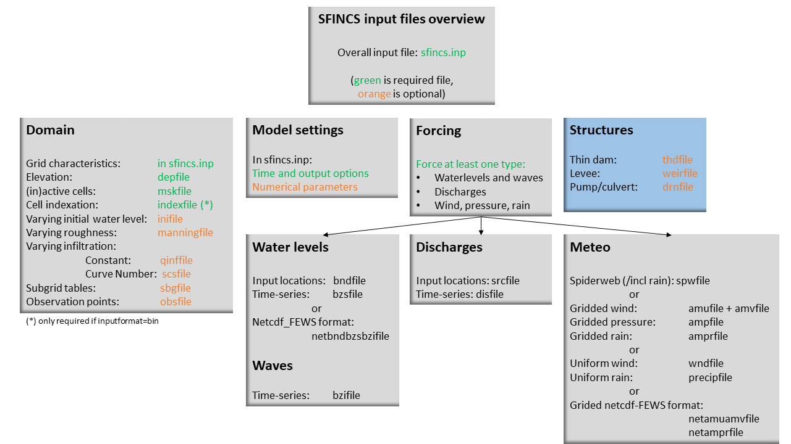
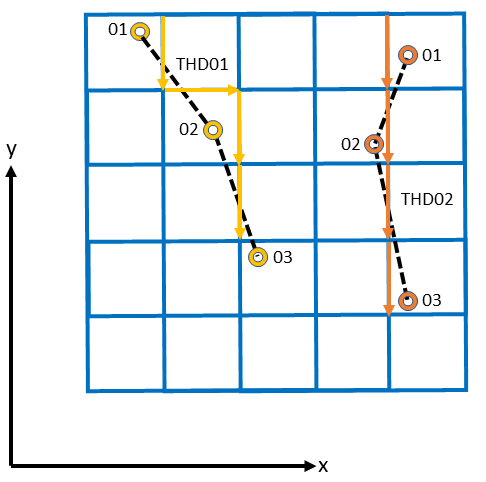
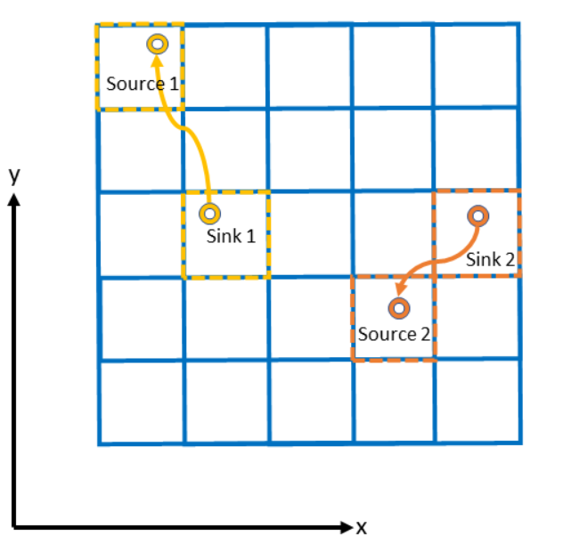

User manual - structures
=====

Overview
-----

The input for SFINCS is supplied using various text and binary files, which are linked through the main input file: sfincs.inp.
Within this section of the user manual all different types of structures to reduce flood hazards with input settings and files are discussed.
The figure below gives an overview of all different types of input files and whether they are required or not.
Below an example is given of this file, which uses a keyword/value layout. 
For more information regarding specific parameters see the pages 'Input parameters' or 'Output parameters'.

**NOTE - In the manual below, blocks named 'Matlab example using OET' are included, referring to easy setup scripts included in the SFINCS’ Open Earth Tools Matlab set of scripts: https://svn.oss.deltares.nl/repos/openearthtools/trunk/matlab/applications/sfincs**

   Overview of input file of SFINCS with indication whther they are required or not

Structures
-----

SFINCS consists of multiple options for adding structures that can divert or block flow of water, which can be used to simulate flood hazard reduction methods.

Thin dam
^^^^^

With a thin dam flow through certain grid cells is completely blocked (i.e. an infinitely high wall).
One can provide multiple polylines within one file, a maximum of 5000 supplied points is supported.
The supplied polylines are snapped onto the SFINCS grid within the model.

   Example of how thin dam/weir input points from 2 different polylines are snapped to the grid of SFINCS.

**thdfile = sfincs.thd**

.. code-block:: text

	NAME1 
	2 2 %size data
	<x0> <y0> %start of polyline 1
	<xend> <yend> %end of polyline 1
	
	NAME2 
	2 2 %size data
	<x0> <y0> %start of polyline 2
	<xend> <yend>  %end of polyline 1
	
	e.g.
	
	THD01
	3 2
	0 100
	10 100
	20 100
	THD02
	2 2
	20 200
	25 200	
	
**Matlab example using OET**

.. code-block:: text

	inp.thdfile = 'sfincs.thd';
	
	thindams(1).x = [0 10 20]; 
	thindams(1).y = [100 100 100]; 
	thindams(1).name = {'THD01'};	
	thindams(2).x = [20 25]; 
	thindams(2).y = [200 200]; 
	thindams(2).name = {'THD02'};
	thindams.length = length(thindams.x1);
	
	sfincs_write_thin_dams(inp.thdfile,thindams);

Weirs
^^^^^

Weirs are in principle the same as a thin dam, but then with a certain height (levee).
When the water level on either or both sides of the weir are higher than that of the weir, a flux over the weir is calculated.
Hereby a situation where the weir is partly or fully submerged is distinguished.
One can provide multiple polylines within one file, a maximum of 5000 supplied points is supported.
Besides the x&y locations per points, also the elevation z and a Cd coefficient for the weir formula (recommended to use 0.6).
The supplied polylines are snapped onto the SFINCS grid within the model.

**weirfile = sfincs.weir**

.. code-block:: text

	NAME1 
	2 4 %size data
	<x0> <y0> <z0> <cd1> %start of polyline 1
	<x2> <y2> <z2> <cd2> %end of polyline 1
	
	NAME2 
	2 4 %size data
	<x0> <y0> <z0> <cd1> %start of polyline 2
	<x2> <y2> <z2> <cd2> %end of polyline 2
	
	e.g.
	
	weir01
	3 4
	0 100 5.1 0.6
	10 100 5.2 0.6
	20 100 5.0 0.6
	weir02
	2 4
	20 200 5.1 0.6
	25 200 5.1 0.6	
	
**Matlab example using OET**

.. code-block:: text
	
	inp.weirfile = 'sfincs.weir';
	
	weirs(1).x = [0 10 20]; 
	weirs(1).y = [100 100 100]; 
	weirs(1).z = [5.1 5.2 5.0]; 
	weirs(1).par1 = [0.6 0.6 0.6]; 	
	weirs(2).x = [20 25]; 
	weirs(2).y = [200 200]; 
	weirs(2).z = [5.1 5.2]; 
	weirs(2).par1 = [0.6 0.6]; 	
	
	sfincs_write_obstacle_file_1par(inp.weirfile,weirs)	
	
Drainage pump and Culvert
^^^^^

Drainage pumps and culverts are both specified using the same format file, put with a different indication of the type (type=1 is drainage pump, type=2 is culvert).
A drainage pump can move water from one location to another with a certain prescribed discharge given that there is sufficient water at the retraction location.
For culverts also a certain discharge capacity of the culvert is prescribed, but then the actual water level gradient is used to determine how much water will actually flow through the culvert.
Input consists of the x&y locations of the sink (retraction point) and source points (outflow point) followed by the type.
The discharge capacity is prescribed using the par1 parameter, parameters par2<>par5 are not used right now but included for future flexibility for implementing other structure types.

   Example of how drainage pump/culvert input points with sink and source locations from 2 different structures are snapped to the grid of SFINCS.

**drnfile = sfincs.drn**

.. code-block:: text

	<xsnk1> <ysnk1> <xsrc1> <ysrc1> <type1> <par1-1> par2-1 par3-1 par4-1 par5-1
	<xsnk2> <ysnk2> <xsrc2> <ysrc2> <type2> <par1-2> par2-2 par3-2 par4-2 par5-2

	e.g. pump:
	50.00        25.00       150.00        25.00 1    0.345    0.000    0.000    0.000    0.000
       	75.00        25.00       125.00        25.00 1    0.345    0.000    0.000    0.000    0.000
       
       	e.g. culvert:
       	50.00        25.00       150.00        25.00 2    0.345    0.000    0.000    0.000    0.000
       	75.00        25.00       125.00        25.00 2    0.345    0.000    0.000    0.000    0.000
	
**Matlab example using OET**

.. code-block:: text

	inp.drnfile = 'sfincs.drn';

	jj=1;
	drain(jj).xsnk = 75; 	% sink x-coordinate(s), from where water is taken
	drain(jj).ysnk = 25; 	% sink y-coordinate(s)
	drain(jj).xsrc = 125; 	% source x-coordinate(s), to where water is discharged
	drain(jj).ysrc = 25; 	% source x-coordinate(s)
	drain(jj).type = 1; 	% 1= pump, 2=culvert
	drain(jj).par1 = 0.345; % possible drainage discharge in m3/s
	drain(jj).par2 = 0; 	% not used yet
	drain(jj).par3 = 0; 	% not used yet
	drain(jj).par4 = 0; 	% not used yet
	drain(jj).par5 = 0; 	% not used yet    

	sfincs_write_drainage_file(inp.drnfile,drain)	
	

