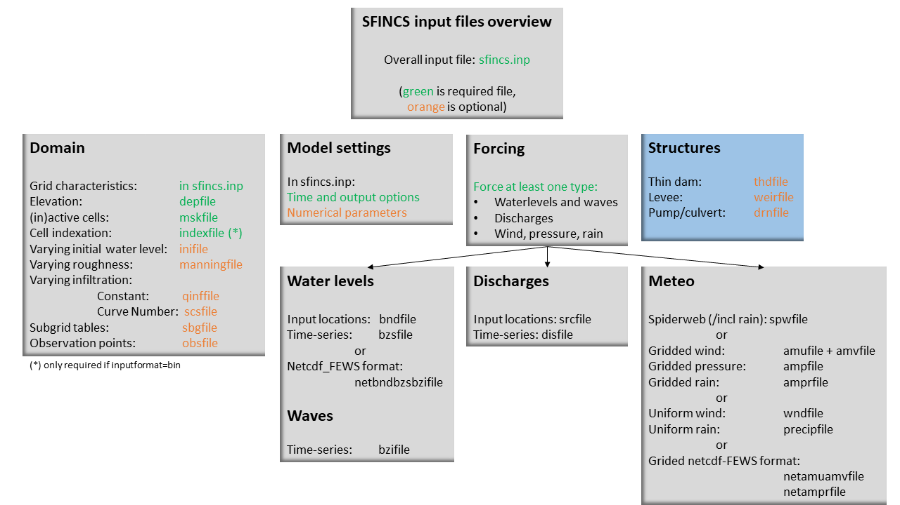
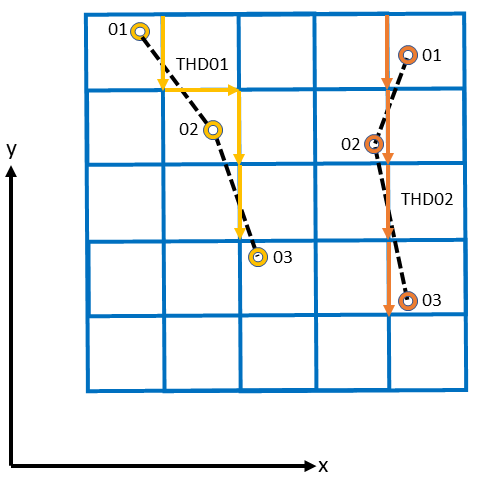
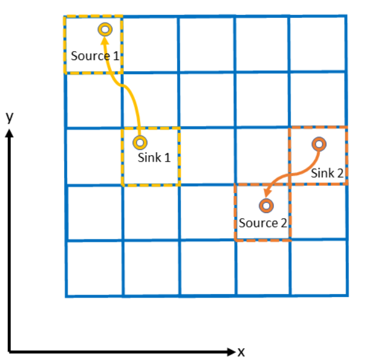

User manual - structures
=====

Overview
-----

The input for SFINCS is supplied using various text and binary files, which are linked through the main input file: sfincs.inp.
This section of the user manual describes the different types of structures that can be used to represent flood hazard reduction measures, together with their input settings and files.
The figure below gives an overview of the input files and indicates whether each one is required or optional.
For more information regarding specific parameters, see the pages 'Input parameters' or 'Output parameters'.

**NOTE - In the manual below, blocks named 'Python example using HydroMT-SFINCS' are included, referring to easy setup functions of the HydroMT-SFINCS Python toolbox: https://deltares.github.io/hydromt_sfincs/latest/**

   Overview of input file of SFINCS with indication whether they are required or not

Flow-blocking structures
------------------------

SFINCS provides several types of structures that block or throttle the flow of water between grid cells, which can be used to simulate flood hazard reduction measures.

Thin dam
^^^^^

A thin dam blocks the cell-to-cell connections (u/v faces) that the polyline snaps to, acting as an infinitely high wall along those faces. Flow parallel to the dam is unaffected — only the normal-component fluxes across the snapped faces are set to zero.
Multiple polylines can be supplied within a single file.
The supplied polylines are snapped onto the SFINCS grid within the model.

   Example of how thin dam/weir input points from 2 different polylines are snapped to the grid of SFINCS.

**thdfile = sfincs.thd**

.. code-block:: text

	NAME1 
	2 2 %size data
	<x0> <y0> %start of polyline 1
	<xend> <yend> %end of polyline 1
	
	NAME2 
	2 2 %size data
	<x0> <y0> %start of polyline 2
	<xend> <yend>  %end of polyline 1
	
	e.g.
	
	THD01
	3 2
	0 100
	10 100
	20 100
	THD02
	2 2
	20 200
	25 200	
	
**Python example using HydroMT-SFINCS**

.. code-block:: python

	sf.thin_dams.create(
		locations="thdfile_input.geojson",
		merge=True
	)
	
	More information: 
	https://deltares.github.io/hydromt_sfincs/latest/_generated/hydromt_sfincs.components.geometries.SfincsThinDams.create.html

Weirs
^^^^^

Weirs are similar to a thin dam, but with a finite crest elevation (like a levee).
When the water level on either or both sides of the weir is higher than the weir crest, a flux over the weir is calculated.
A distinction is made between free (modular) flow and submerged flow, using a broad-crested weir formula:

.. math::

   q =
   \begin{cases}
   C_d \cdot 1.7049 \cdot h_1^{3/2},                     & h_2 \le \tfrac{2}{3}\, h_1 \quad\text{(free flow)} \\
   C_d \cdot h_2 \cdot \sqrt{2\, g\, (h_1 - h_2)},       & h_2 >   \tfrac{2}{3}\, h_1 \quad\text{(submerged)}
   \end{cases}

where :math:`h_1 = \max(z_{s,\text{up}} - z_\text{weir},\, 0)` is the head above the crest on the upstream side, :math:`h_2 = \max(z_{s,\text{dn}} - z_\text{weir},\, 0)` is the head on the downstream side, :math:`z_\text{weir}` is the user-supplied crest elevation, :math:`C_d` is the user-supplied discharge coefficient (0.6 is a typical value), and :math:`g = 9.81` m/s². The discharge :math:`q` is per unit width; SFINCS multiplies by the length of the weir segment inside each grid cell. The constant 1.7049 is :math:`\tfrac{2}{3}\sqrt{\tfrac{2}{3} g}`, the standard broad-crested free-flow coefficient.

Each point in the weir file carries its x and y location, the crest elevation z, and the :math:`C_d` coefficient.
The supplied polylines are snapped onto the SFINCS grid within the model.
While running SFINCS, the number of structure uv-points found (after snapping) is displayed, e.g.::

   Info : 7932 structure u/v points found

Note that this is the count after snapping to the grid (at most 2 per grid cell), not the number of points supplied in the input.

The snapped coordinates are available in sfincs_his.nc as structure_x, structure_y & structure_height from SFINCS v2.0.2 onwards.

**weirfile = sfincs.weir**

.. code-block:: text

	NAME1 
	2 4 %size data
	<x0> <y0> <z0> <cd1> %start of polyline 1
	<x2> <y2> <z2> <cd2> %end of polyline 1
	
	NAME2 
	2 4 %size data
	<x0> <y0> <z0> <cd1> %start of polyline 2
	<x2> <y2> <z2> <cd2> %end of polyline 2
	
	e.g.
	
	weir01
	3 4
	0 100 5.1 0.6
	10 100 5.2 0.6
	20 100 5.0 0.6
	weir02
	2 4
	20 200 5.1 0.6
	25 200 5.1 0.6	
	
**Python example using HydroMT-SFINCS**

.. code-block:: python

	sf.weirs.create(
		locations="weirfile_input.geojson",
		dz=None,
		merge=True
	)
	
	More information: 
	https://deltares.github.io/hydromt_sfincs/latest/_generated/hydromt_sfincs.components.geometries.SfincsWeirs.create.html

**NOTE - If your weir elevation is unknown a priori, you can also let HydroMT-SFINCS derive this from an input (high-resolution) DEM by specifying 'dep'**

**NOTE - If your weir elevation is unknown a priori, you can also let HydroMT-SFINCS derive this from an input (low-resolution) DEM by specifying 'dep' and adding a certain assumed elevation 'dz'**

Drainage Structures
-------------------

.. important::

   **Drainage structures do not block flow.** They simply transfer water
   from one grid cell (the intake, ``src_1``) to another (the outfall,
   ``src_2``), without representing any physical barrier. If the drainage
   path passes through an embankment, dam face, or culvert wall that is
   not already resolved by the model topography, that blocking
   geometry must be added separately using a thin dam or a weir. Without
   it, water will simply flow around the drainage structure as if it were
   not there.

**Overview**

SFINCS supports four types of internal drainage structures that move water between two grid cells without resolving the flow through a physical momentum equation. They are configured through a single file (typically sfincs.drn, TOML format), referenced from ``sfincs.inp`` with the ``drnfile`` keyword:

.. code-block:: text

   drnfile = sfincs.drn

The four structure types are:

- ``pump`` — drainage pump. Moves a prescribed discharge ``q`` from ``src_1`` to ``src_2``, limited by available water.
- ``culvert_simple`` — lumped one-coefficient culvert. Bidirectional by default.
- ``culvert`` — regime-aware detailed culvert with geometry (width, height, invert elevations) and a submergence threshold.
- ``gate`` — bidirectional gate with a sill and an inertial culvert-style momentum update (Bates et al., 2010).

All structures can be driven by optional rule expressions (see :ref:`open/close rules <drn_rules>` below) that open or close the structure based on water levels at user-chosen observation cells.

You can record how much discharge each structure extracts in the ``sfincs_his.nc`` output by setting ``storeqdrain = 1`` in ``sfincs.inp``.

   Example of how drainage pump/culvert input points with sink and source locations from 2 different structures are snapped to the grid of SFINCS.

**Common input keys**

Every ``[[src_structure]]`` block carries a small set of keys that are shared across all four types. Per-type required and optional keys are documented in the sub-subsections further below.

.. list-table::
   :header-rows: 1
   :widths: 22 14 64

   * - Key
     - Type
     - Description
   * - **name**
     - string
     - Unique identifier for the structure. Required.
   * - **type**
     - string
     - One of ``"pump"``, ``"culvert_simple"``, ``"culvert"``, ``"gate"``. The legacy alias ``"check_valve"`` maps to ``culvert_simple`` with ``direction = "positive"``. Required.
   * - **src_1_x, src_1_y**
     - real
     - Coordinates of the intake (``src_1``) cell, in the grid CRS. Required.
   * - **src_2_x, src_2_y**
     - real
     - Coordinates of the outfall (``src_2``) cell, in the grid CRS. Required.
   * - obs_1_x, obs_1_y
     - real
     - Coordinates of the observation cell feeding the ``z1`` atom in rule expressions. Default: the ``src_1`` coordinates.
   * - obs_2_x, obs_2_y
     - real
     - Coordinates of the observation cell feeding the ``z2`` atom in rule expressions. Default: the ``src_2`` coordinates.
   * - direction
     - string
     - Flow-direction filter. One of ``"both"`` (default), ``"positive"`` (allow flow ``src_1 -> src_2`` only), ``"negative"`` (allow flow ``src_2 -> src_1`` only). Meaningful for bidirectional types (``culvert_simple``, ``culvert``); ``pump`` is one-way by construction and ``gate`` is typically left bidirectional.
   * - opening_duration
     - real
     - Ramp time (s) for the closed → open transition. Default: **600.0** for ``gate``; **0.0** (instant) for ``pump``, ``culvert_simple``, ``culvert``.
   * - closing_duration
     - real
     - Ramp time (s) for the open → closed transition. Same defaults as ``opening_duration``.
   * - rules_open
     - string
     - Water-level expression that triggers opening. See :ref:`open/close rules <drn_rules>`.
   * - rules_close
     - string
     - Water-level expression that triggers closing. See :ref:`open/close rules <drn_rules>`.

Pump
^^^^

A drainage pump moves water from the intake cell ``src_1`` to the outfall cell ``src_2`` at a prescribed discharge ``q`` (m³/s). The discharge is signed in the sense that ``q > 0`` pumps from ``src_1`` to ``src_2``; ``q < 0`` reverses the direction. As the upstream depth drops below a small internal threshold (0.1 m, hard-coded), the discharge is scaled linearly so the pump cannot pump a cell dry:

.. math::

   Q = q \cdot \min\!\left(1,\, \frac{h_\text{up}}{0.1~\text{m}}\right)

.. list-table::
   :header-rows: 1
   :widths: 22 14 64

   * - Key
     - Type
     - Description
   * - **q**
     - real
     - Nominal pump discharge in m³/s. Required. The dry-prevention scaling above is an internal safety and is not user-tunable.

All common keys (``name``, ``type``, ``src_*``, ``obs_*``, ``direction``, ``opening_duration``, ``closing_duration``, ``rules_open``, ``rules_close``) are accepted as documented in the common-keys table above.

.. code-block:: toml

   [[src_structure]]
   name        = "south_pump"
   type        = "pump"
   src_1_x     =  50.0
   src_1_y     =  25.0
   src_2_x     = 150.0
   src_2_y     =  25.0
   q           = 0.345
   rules_open  = "z1 > 0.20"
   rules_close = "z1 < 0.05"

Culvert (simple)
^^^^^^^^^^^^^^^^

The simple culvert uses a single lumped coefficient and a square-root head-difference law. It is the fastest choice when geometry is unknown or unimportant. Setting ``direction = "positive"`` (or equivalently using the ``check_valve`` type alias) turns the structure into a check valve that blocks backflow — useful for one-way tide gates and similar features.

.. math::

   Q = c_f \cdot \operatorname{sign}(\Delta h) \cdot \sqrt{|\Delta h|}

with :math:`\Delta h = z_{s,1} - z_{s,2}`.

.. list-table::
   :header-rows: 1
   :widths: 22 14 64

   * - Key
     - Type
     - Description
   * - **flow_coef**
     - real
     - Lumped discharge coefficient :math:`c_f` from the formula above (units chosen so the formula returns m³/s when ``Δh`` is in m). Required.

All common keys are accepted. Set ``direction = "positive"`` (or use ``type = "check_valve"``) to block backflow.

.. code-block:: toml

   [[src_structure]]
   name      = "north_check_valve"
   type      = "culvert_simple"
   direction = "positive"
   src_1_x   =  75.0
   src_1_y   =  25.0
   src_2_x   = 125.0
   src_2_y   =  25.0
   flow_coef = 0.345

Culvert (detailed)
^^^^^^^^^^^^^^^^^^

The detailed culvert resolves the two usual culvert regimes — submerged (orifice-like) and free / inlet-controlled — based on the ratio of downstream to upstream heads above the controlling sill. The controlling sill is the higher of the two inverts, :math:`z_\text{sill} = \max(\text{invert}_1, \text{invert}_2)`; upstream and downstream are assigned on the fly from the sign of :math:`\Delta h`, so the structure is bidirectional (restrict with ``direction`` if needed).

Let :math:`h_\text{up}`, :math:`h_\text{dn}` be the upstream and downstream depths above :math:`z_\text{sill}`, and :math:`A_\text{eff} = w \cdot \min(h_\text{up}, H)` (capped at barrel height). Then

.. math::

   Q =
   \begin{cases}
   c_f \cdot A_\text{eff} \cdot \sqrt{2 g\, |\Delta h|}, & h_\text{dn}/h_\text{up} \ge r_\text{sub} \quad\text{(submerged)} \\
   c_f \cdot A_\text{eff} \cdot \sqrt{2 g\, h_\text{up}}, & h_\text{dn}/h_\text{up} < r_\text{sub} \quad\text{(free / inlet-controlled)}
   \end{cases}

.. list-table::
   :header-rows: 1
   :widths: 22 14 64

   * - Key
     - Type
     - Description
   * - **width**
     - real
     - Culvert barrel width (m). Required.
   * - **height**
     - real
     - Culvert barrel height (m). Used to cap the flow area. Required.
   * - **invert_1**
     - real
     - Invert elevation at the ``src_1`` end (m, same datum as ``zb``). Required.
   * - **invert_2**
     - real
     - Invert elevation at the ``src_2`` end (m, same datum as ``zb``). Required.
   * - flow_coef
     - real
     - Orifice discharge coefficient :math:`c_f`. Default: **0.6**.
   * - submergence_ratio
     - real
     - Threshold :math:`r_\text{sub}` on :math:`h_\text{dn}/h_\text{up}` that switches between the two regimes. Default: **0.667** (the classic broad-crested-weir / Villemonte value).

All common keys are accepted.

.. code-block:: toml

   [[src_structure]]
   name              = "west_culvert"
   type              = "culvert"
   src_1_x           = 100.0
   src_1_y           =  50.0
   src_2_x           = 100.0
   src_2_y           = 150.0
   width             = 1.2
   height            = 1.0
   invert_1          = 0.20
   invert_2          = 0.15
   flow_coef         = 0.6
   submergence_ratio = 0.667

Gate
^^^^

The gate is a bidirectional opening with a horizontal sill. Discharge is computed from an inertial culvert-style momentum update (Bates et al., 2010), per unit width, and then multiplied by the gate ``width``. The previous-step discharge :math:`q^n` is carried through the relaxation blend, so the gate has memory on the order of ``structure_relax`` time steps.

With :math:`h = \max(\max(z_{s,1}, z_{s,2}) - z_\text{sill},\, 0)` and :math:`\partial z_s/\partial s = (z_{s,2} - z_{s,1})/L`:

.. math::

   q^{n+1} =
   \frac{q^n - g\, h\, (\partial z_s/\partial s)\, \Delta t}
        {1 + g\, n^2\, \Delta t\, |q^n| / h^{7/3}}

then :math:`Q = c_f \cdot q^{n+1} \cdot w \cdot \text{fraction\_open}`, where :math:`c_f` is ``flow_coef``.

.. list-table::
   :header-rows: 1
   :widths: 22 14 64

   * - Key
     - Type
     - Description
   * - **width**
     - real
     - Gate width (m). Required.
   * - **sill_elevation**
     - real
     - Sill elevation :math:`z_\text{sill}` (m, same datum as ``zb``). Required.
   * - mannings_n
     - real
     - Manning's roughness coefficient on the gate sill. Default: **0.024** (concrete-lined).
   * - flow_coef
     - real
     - Lumped discharge coefficient :math:`c_f` from the formula above, accounting for additional losses not captured by the Manning friction term. Default: **1.0** (no extra loss).

All common keys are accepted. The gate defaults ``opening_duration`` and ``closing_duration`` to **600 s** (matching legacy ``dtype = 4`` behaviour) rather than the 0 s default used by the other three types.

.. code-block:: toml

   [[src_structure]]
   name             = "east_tide_gate"
   type             = "gate"
   src_1_x          = 200.0
   src_1_y          =  25.0
   src_2_x          = 250.0
   src_2_y          =  25.0
   obs_2_x          = 260.0   # observe water level just outside the gate
   obs_2_y          =  25.0
   width            = 3.0
   sill_elevation   = 0.20
   mannings_n       = 0.024
   opening_duration = 300.0
   closing_duration = 300.0
   rules_open       = "z2-z1 > 0.10"
   rules_close      = "z2-z1 < 0.0 | z2>1.0"

.. _drn_rules:

**Open/close rules and the state machine**

Each structure has an internal state machine with four states:

- ``0`` — closed
- ``1`` — open
- ``2`` — opening (transient, time-based)
- ``3`` — closing (transient, time-based)

On a time step, if the current state is ``0`` (closed), the ``rules_open`` expression is evaluated; if it fires, the state advances to ``2`` (opening) and ``fraction_open`` ramps from 0 to 1 linearly over ``opening_duration`` seconds. Symmetrically, from state ``1`` (open) a firing ``rules_close`` expression moves the state to ``3`` (closing) with ``fraction_open`` ramping from 1 to 0 over ``closing_duration`` seconds. The transient states advance on elapsed time only, so rule hysteresis cannot thrash. When ``opening_duration`` (or ``closing_duration``) is ``0.0``, the transition is instantaneous and the transient state is skipped. Structures that specify neither ``rules_open`` nor ``rules_close`` stay at the init-time default (``status = 1``, ``fraction_open = 1.0``) and the state-machine scaling is a no-op.

The rule expressions use a compact boolean grammar. Atoms are ``z1``, ``z2``, and ``z2-z1`` (all three case-insensitive); there is **no** ``z1-z2`` atom — invert the comparison sign instead. ``z1`` is the water level in the ``obs_1`` cell and ``z2`` is the water level in the ``obs_2`` cell. Comparison operators are ``<`` and ``>`` only (no ``<=`` / ``>=``). Boolean connectives are ``&`` (and) and ``|`` (or); parentheses can be used for grouping.

Examples:

.. code-block:: text

   rules_open  = "z1 > 0.5"                               # open whenever intake rises above 0.5 m
   rules_close = "z2 > 2.0"                               # close when the outfall floods above 2 m
   rules_open  = "(z1 < 0.5 | z2-z1 > 0.05) & z2 < 1.5"   # complex trigger
   rules_close = "z2-z1 > 0.3"                            # close when outfall gets 0.3 m higher than intake

**Discharge relaxation: structure_relax**

Discharges from src structures are relaxation-blended between time steps to damp oscillations:

.. math::

   q^{n+1}_{\text{blended}} = \alpha \, q^{n+1}_{\text{raw}} + (1 - \alpha) \, q^{n}, \qquad \alpha = \frac{1}{N}

where :math:`N` is set by the ``structure_relax`` keyword in ``sfincs.inp`` — a dimensionless step count: a value of :math:`N` damps the discharge response over roughly :math:`N` time steps. Default is ``4.0``; typical range is 1 (no smoothing) to 10.

**Output: storing structure discharges**

Set ``storeqdrain = 1`` in ``sfincs.inp`` to write the time-series discharge per structure into ``sfincs_his.nc``.

**Example sfincs.drn file**

.. code-block:: toml

   # sfincs.drn

   [[src_structure]]
   name             = "south_pump"
   type             = "pump"
   src_1_x          =  50.0
   src_1_y          =  25.0
   src_2_x          = 150.0
   src_2_y          =  25.0
   q                = 0.345                     # pump discharge (m^3/s)
   rules_open       = "z1 > 0.20"               # start pumping when intake > 0.20 m
   rules_close      = "z1 < 0.05"               # stop pumping when intake drops below 0.05 m

   [[src_structure]]
   name             = "north_check_valve"
   type             = "culvert_simple"
   direction        = "positive"                # one-way; blocks backflow
   src_1_x          =  75.0
   src_1_y          =  25.0
   src_2_x          = 125.0
   src_2_y          =  25.0
   flow_coef        = 0.345

   [[src_structure]]
   name             = "west_culvert"
   type             = "culvert"
   src_1_x          = 100.0
   src_1_y          =  50.0
   src_2_x          = 100.0
   src_2_y          = 150.0
   width            = 1.2
   height           = 1.0
   invert_1         = 0.20
   invert_2         = 0.15
   flow_coef        = 0.6                       # orifice discharge coefficient
   submergence_ratio = 0.667                    # h_dn/h_up threshold between submerged and inlet control

   [[src_structure]]
   name             = "east_tide_gate"
   type             = "gate"
   src_1_x          = 200.0
   src_1_y          =  25.0
   src_2_x          = 250.0
   src_2_y          =  25.0
   obs_2_x          = 260.0                     # observe water level just outside the gate
   obs_2_y          =  25.0
   width            = 3.0
   sill_elevation   = 0.20
   mannings_n       = 0.024
   opening_duration = 300.0                     # 5-minute ramp open
   closing_duration = 300.0
   rules_open       = "z2-z1 > 0.10"            # open when outer level exceeds inner by 0.10 m
   rules_close      = "z2-z1 < 0.0 | z2>1.0"    # close on reversal (prevents backflow) or when outer water level exceeds 1.0 m

**Python example using HydroMT-SFINCS**

.. code-block:: python

   sf.drainage_structures.create(
       locations="drainage_input.geojson",
       stype='pump',
       discharge=100.0,
       merge=True
   )

   # OR as a culvert:

   sf.drainage_structures.create(
       locations="drainage_input.geojson",
       stype='culvert',
       discharge=100.0,
       merge=True
   )

More information:
https://deltares.github.io/hydromt_sfincs/latest/_generated/hydromt_sfincs.components.geometries.SfincsDrainageStructures.create.html

**Legacy fixed-column drn format**

The legacy ASCII fixed-column ``.drn`` format is still accepted for back-compatibility. Each non-blank, non-comment line describes one structure with the columns:

.. code-block:: text

   <x1> <y1> <x2> <y2> <type> <par1>

where ``type`` is:

- ``1`` — pump (``par1`` = pump discharge)
- ``2`` — culvert (``par1`` = ``flow_coef``; maps to ``culvert_simple``)
- ``3`` — check valve (``par1`` = ``flow_coef``; maps to ``culvert_simple`` with ``direction = "positive"``)

Example:

.. code-block:: text

   # pump:
    50.00  25.00 150.00  25.00  1  0.345
    75.00  25.00 125.00  25.00  1  0.345

   # culvert:
    50.00  25.00 150.00  25.00  2  0.345
    75.00  25.00 125.00  25.00  2  0.345

When SFINCS sees a legacy ``.drn`` file it automatically transcribes it to a sibling TOML file (``sfincs.toml.drn`` if the input was ``sfincs.drn``) and then reads that. Water-level-triggered legacy gates (``type = 4``) are converted to TOML ``gate`` blocks with synthesised ``rules_open`` / ``rules_close`` expressions derived from the legacy ``zmin`` / ``zmax`` columns. Schedule-triggered legacy gates (``type = 5``) are refused; the rule grammar is water-level-only and has no time atom — rewrite those as TOML gates driven by observed water levels.

.. important::

   **After a legacy transcription, strongly consider renaming the generated
   ``sfincs.toml.drn`` file to ``sfincs.drn`` (overwriting the original legacy
   file) and pointing ``drnfile`` at it.** Future simulations will then read
   the TOML directly, skipping the transcription step and giving you a single
   source of truth that you can edit, version-control, and extend with the
   newer keywords (``rules_open`` / ``rules_close``, ``reduction_depth``,
   ``submergence_ratio``, ``direction``, per-structure invert pairs, etc.)
   that the legacy format cannot express. Keep a backup of the original
   legacy file elsewhere if you need it for reference.

New models should be written directly in TOML; the legacy reader exists purely so that pre-TOML input decks keep running.
