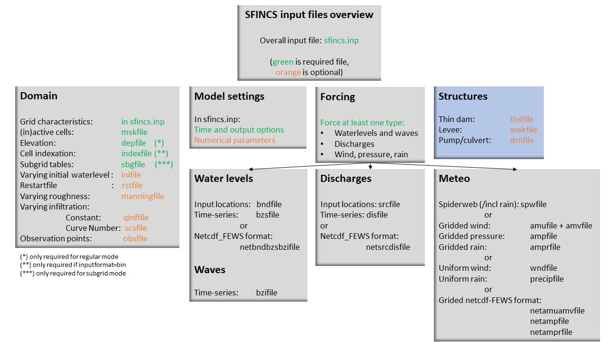

User manual - structures
=====

Overview
-----

The input for SFINCS is supplied using various text and binary files, which are linked through the main input file: sfincs.inp.
Within this section of the user manual all different types of structures to reduce flood hazards with input settings and files are discussed.
The figure below gives an overview of all different types of input files and whether they are required or not.
Below an example is given of this file, which uses a keyword/value layout. 
For more information regarding specific parameters see the pages 'Input parameters' or 'Output parameters'.

**NOTE - In the manual below, blocks named 'Python example using HydroMT-SFINCS' are included, referring to easy setup functions of the HydroMT-SFINCS Python toolbox: https://deltares.github.io/hydromt_sfincs/latest/**

   Overview of input file of SFINCS with indication whther they are required or not

Structures
-----

SFINCS consists of multiple options for adding structures that can divert or block flow of water, which can be used to simulate flood hazard reduction methods.

Thin dam
^^^^^

With a thin dam flow through certain grid cells is completely blocked (i.e. an infinitely high wall).
One can provide multiple polylines within one file, a maximum of 5000 supplied points is supported.
The supplied polylines are snapped onto the SFINCS grid within the model.

   Example of how thin dam/weir input points from 2 different polylines are snapped to the grid of SFINCS.

**thdfile = sfincs.thd**

.. code-block:: text

	NAME1 
	2 2 %size data
	<x0> <y0> %start of polyline 1
	<xend> <yend> %end of polyline 1
	
	NAME2 
	2 2 %size data
	<x0> <y0> %start of polyline 2
	<xend> <yend>  %end of polyline 1
	
	e.g.
	
	THD01
	3 2
	0 100
	10 100
	20 100
	THD02
	2 2
	20 200
	25 200	
	
**Python example using HydroMT-SFINCS**

.. code-block:: text

	sf.setup_structures(
		structures="thdfile_input.geojson",
		stype='thd',
		merge=True
	)
	
	More information: 
	https://deltares.github.io/hydromt_sfincs/latest/api.html#setup-components

Weirs
^^^^^

Weirs are in principle the same as a thin dam, but then with a certain height (levee).
When the water level on either or both sides of the weir are higher than that of the weir, a flux over the weir is calculated.
Hereby a situation where the weir is partly or fully submerged is distinguished.
One can provide multiple polylines within one file, a maximum of 5000 supplied points is supported.
Besides the x&y locations per points, also the elevation z and a Cd coefficient for the weir formula (recommended to use 0.6).
The supplied polylines are snapped onto the SFINCS grid within the model.

The snapped coordinates are available in sfincs_his.nc as structure_x, structure_y & structure_height from SFINCS v2.0.2 onwards.

**weirfile = sfincs.weir**

.. code-block:: text

	NAME1 
	2 4 %size data
	<x0> <y0> <z0> <cd1> %start of polyline 1
	<x2> <y2> <z2> <cd2> %end of polyline 1
	
	NAME2 
	2 4 %size data
	<x0> <y0> <z0> <cd1> %start of polyline 2
	<x2> <y2> <z2> <cd2> %end of polyline 2
	
	e.g.
	
	weir01
	3 4
	0 100 5.1 0.6
	10 100 5.2 0.6
	20 100 5.0 0.6
	weir02
	2 4
	20 200 5.1 0.6
	25 200 5.1 0.6	
	
**Python example using HydroMT-SFINCS**

.. code-block:: text

	sf.setup_structures(
		structures="weirfile_input.geojson",
		stype='weir',
		dz=None
		merge=True
	)
	
	More information: 
	https://deltares.github.io/hydromt_sfincs/latest/api.html#setup-components
	https://deltares.github.io/hydromt_sfincs/latest/_examples/build_from_script.html

**NOTE - If your weir elevation is unknown a priori, you can also let HydroMT-SFINCS derive this from an input (high-resolution) DEM by specifying 'dep'**

**NOTE - If your weir elevation is unknown a priori, you can also let HydroMT-SFINCS derive this from an input (low-resolution) DEM by specifying 'dep' and adding a certain assumed elevation 'dz'**

Drainage Pumps and Culverts
^^^^^

**Introduction**

In SFINCS, drainage pumps and culverts are specified using the same input file format, with the structure type distinguished by an indicator:
- type=1: Drainage pump
- type=2: Culvert

A drainage pump moves water from a retraction point (source location) to an outflow point (sink location) at a specified discharge rate, as long as there is enough water available at the retraction point. The discharge rate is defined using the par1 parameter.

For culverts**, par1 represents the discharge capacity. The actual flow through the culvert depends on the water level difference (head difference) between the upstream and downstream ends. This gradient determines how much water flows through the culvert based on the capacity defined in par1.

**Input Parameters**

- x & y locations: Coordinates for the retraction (source) and outflow (sink) points.
- Type: Specifies if the structure is a drainage pump (type=1) or a culvert (type=2).
- par1: Sets the discharge capacity. Additional parameters (par2 to par5) are included as placeholders for future updates.

You can know how much discharge is extracted by the model in the sfincs_his.nc output by specifying 'storeqdrain=1' from SFINCS v2.0.2 onwards, see the description in "Input parameters".

   Example of how drainage pump/culvert input points with sink and source locations from 2 different structures are snapped to the grid of SFINCS.

**drnfile = sfincs.drn**

.. code-block:: text

	<xsnk1> <ysnk1> <xsrc1> <ysrc1> <type1> <par1-1> par2-1 par3-1 par4-1 par5-1
	<xsnk2> <ysnk2> <xsrc2> <ysrc2> <type2> <par1-2> par2-2 par3-2 par4-2 par5-2

	e.g. pump:
	50.00        25.00       150.00        25.00 1    0.345    0.000    0.000    0.000    0.000
       	75.00        25.00       125.00        25.00 1    0.345    0.000    0.000    0.000    0.000
       
       	e.g. culvert:
       	50.00        25.00       150.00        25.00 2    0.345    0.000    0.000    0.000    0.000
       	75.00        25.00       125.00        25.00 2    0.345    0.000    0.000    0.000    0.000
	
**Python example using HydroMT-SFINCS**

.. code-block:: text

	sf.setup_drainage_structures(
		structures="drainage_input.geojson",
		stype='pump'
		discharge=100.0
		merge=True
	)
	
	OR as a culvert:
	
	sf.setup_drainage_structures(
		structures="drainage_input.geojson",
		stype='culvert'
		discharge=100.0
		merge=True
	)

	More information: 
	https://deltares.github.io/hydromt_sfincs/latest/api.html#setup-components
	
**Calculating Culvert Discharge Capacity**

For culverts, par1 (discharge capacity) can be calculated as:

``par1 = \(\mu \cdot A \cdot \sqrt{2g}\)``

where:

* \(\mu\) = dimensionless culvert loss coefficient, typically between 0 and 1
* \(A\) = area of the culvert opening (m²)
* \(g\) = gravitational acceleration (9.81 m/s²)

This formula is derived from the Bernoulli Equation, which estimates flow based on the head difference.

* If \(\mu = 1\), the flow is assumed to be driven entirely by the head difference, with no friction or length-based losses.
* If \(\mu < 1\), it accounts for additional energy losses, such as friction and entry/exit losses.

**Planned Enhancements**

Future updates will incorporate the Darcy–Weisbach equation for more accurate discharge estimates by considering frictional and minor losses along the culvert length, which is particularly useful for longer or rougher conduits.
