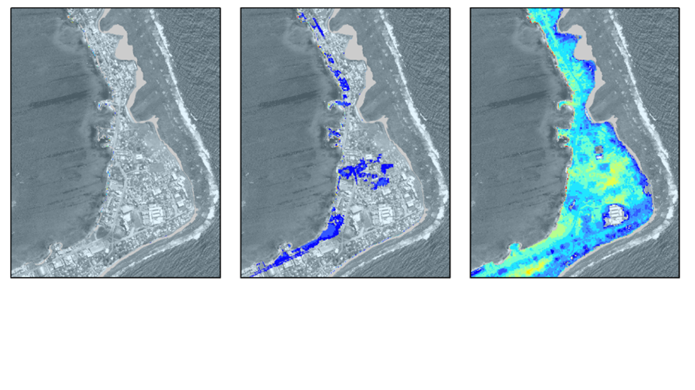

Introduction
=======

Introduction to SFINCS
----------------------

What is SFINCS?
^^^^^^^^^

SFINCS (Super-Fast Inundation of CoastS) is a reduced-complexity model capable of simulating compound flooding with a high computational efficiency balanced with an adequate accuracy.
In SFINCS a set of momentum and continuity equations are solved with a first order explicit scheme based on Bates et al. (2010).
Traditionally SFINCS neglects the advection term (SFINCS-LIE) which generally justified for sub-critical flow conditions. 
For super-critical flow conditions or when modelling waves, the advection term needs to be solved. 
For this purpose, the SFINCS-SSWE version can be used (including advection).
For more information see Leijnse et al. (2020): https://doi.org/10.1016/j.coastaleng.2020.103796

Why SFINCS?
^^^^^^^^^
Compound flooding during tropical cyclones and other extreme events result in tremendous amounts of property damage and loss of life. Early warning systems and multi-hazard risk analysis can reduce these impacts. 
However, large numbers of computations need to be run in a probabilistic approach and in a short time due to uncertainties in the meteorological forcing. 
Current modelling approaches are either fast but too simple (bathtub approach) or models are very accurate but too slow (e.g. Delft3D, XBeach).
SFINCS balances a high computational efficiency with adequate accuracy.

   The goal of SFINCS: speed! (Icon made by https://www.flaticon.com/authors/vectors-market)

Compound flooding?
^^^^^^^^^
Compound flooding is described as events occurring in coastal areas where the interaction of high sea levels, large river discharges and local precipitation causes (extreme) flooding (Wahl et al., 2015).
To simulate compound flooding events, a model needs to be able to model all these types of forcings. Therefore, SFINCS includes fluvial, pluvial, tidal, wind- and wave-driven processes!

Types of environments to use SFINCS for
-----

Coastal model
^^^^^^^^^

A SFINCS model in coastal regions can be forced with marine forcings like tides, storm surge, local wind setup and wave driven processes.
Generally a model is setup with the offshore boundary in the swash zone, good practice is in about 2 meters water depth.
In SFINCS it is possible to distinguish cells that are made inactive in the computation so it will not slow your model down (in this case everywhere deeper than 2m water depth).
In some cases local rainfall might be relevant too for a coastal model.

   SFINCS model for Sao Tome en Principe, figure from: https://doi.org/10.5194/nhess-20-2397-2020
   
   
Coral reef model
^^^^^^^^^
SFINCS models have also been setup in coral reef type environments, where individual waves are forced to compute wave-driven flooding.
This generally has a large contribution to flooding for Small Island Developping States (SIDS) or other coasts/islands with coral reef type coasts.

   SFINCS model for Majuro.
   
Tsunami model
^^^^^^^^^
As an additional type of coastal model, SFINCS has also been used for modelling tsunami's.
Generally this would be an overland model forced with a tsunami wave as computed by an offshore hydrodynamic model.
However, in the paper of Robke et al. 2021 SFINCS was also used for the first time to calculate the offshore propagation in a very short amount of time too.
Get in touch to hear more about possibilities for tsunami modelling with SFINCS.

.. figure:: ./figures/Figure_tsunami_model.jpg
   :width: 600px
   :align: center

   Overland and offshore SFINCS models modelling the 2011 Tohoku tsunami near Japan, figure from: https://doi.org/10.3390/jmse9050453
   
Storm surge model
^^^^^^^^^
Since speed is wanted everywhere, also tests have been done to let SFINCS model offshore storm surge during tropical cyclones.
Get in touch to hear more about possibilities for storm surge modelling with SFINCS.

Riverine model
^^^^^^^^^
For inland riverine types of environments, boundary conditions are generally different than for coastal models.
Generally at the upstream end of rivers, one can provide discharge points with discharge time-series.
At the downstream end of rivers, water level time-series need to be specified, which in case of sub-critical flow conditions will influence the flow upstream.
Additionaly, besides the general river discharge, local rainfall adding water to the river can be very relevant too.

   SFINCS model for Vientiane, Laos.
   
Urban model
^^^^^^^^^
For urban environments the local situation of varying land use conditions can heavily influence the local flow.
Therefore spatially varying input of manning roughness and infiltration is possible.
The curve number method of infiltration will distinguish what part of falling precipitation can infiltrate or will run-off.
To test out the effect of interventions, it is possible to insert different types of structures into the SFINCS model.
These can be thin dams, levees, sea walls, simple drainage pumps or culverts.

.. figure:: ./figures/Figure_urban_model.png
   :width: 600px
   :align: center

   SFINCS model for Houston, TX, during Hurricane Harvey (2017)

Flash flood model
^^^^^^^^^
In recent tests, SFINCS has also been used to model flash floods.
In these events, a short but intense rainfall event falls onto a domain and together with a steep profile can lead to significant water depths and flow velocities.
Get in touch to hear more about possibilities for fast flash-flood modelling with SFINCS.

.. figure:: ./figures/Figure_flashflood_model.png
   :width: 600px
   :align: center

   SFINCS model for Izmir, Turkey

Compound flooding model
^^^^^^^^^
In a compound flooding model, all relevant types of forcing from either coastal, coral, riverine or urban models can be combined into 1 domain.
Hereby the joint effect of multiple flood drivers that can enhance flooding can be taken into account.

.. figure:: ./figures/Figure_compound_model.png
   :width: 600px
   :align: center

   SFINCS model for Jacksonville, FL, during Hurricane Irma (2017), figure from: https://doi.org/10.1016/j.coastaleng.2020.103796

Validation cases
-----
The model is validated in the recently published paper about SFINCS:

"Modeling compound flooding in coastal systems using a computationally efficient reduced-physics solver: including fluvial, pluvial, tidal, wind- and wave-driven processes" - Leijnse et al. 2020 - 

Performed tests here were:

* Environmental Agency test 2: Filling of floodplain depressions

* Environmental Agency test 5: River valley flooding

* Dam-break test with an initial wet bed

* Carrier and Greenspan (1958) wave runup

* Compound flooding during Hurricane Irma at Jacksonville, Florida

* Wave-driven flooding during Typhoon Haiyan at Hernani, the Philippines

Currently, a hindcast of the flooding at Houston, Texas, during Hurricane Harvey as modelled by SFINCS is in review: 

"Hindcast of Pluvial, Fluvial, and Coastal Flood Damage in Houston, Texas during Hurricane Harvey (2017) using SFINCS" Sebastian et al. 2020, in review

Modelling tsunami driven flooding at Sendai, Japan, during the 2011 Tohoku tsunami: https://doi.org/10.3390/jmse9050453

Applications where SFINCS was used
-----

Recently this paper is published using SFINCS to model flooding for SIDS: "Uncertainties in coastal flood risk assessments in small island developing states" - Parodi et al. 2020 https://nhess.copernicus.org/articles/20/2397/2020/

SFINCS has also been applied (or still is) in multiple international projects:

* Modelling compound flooding for the islands of Sao Tome en Principe

* Modelling tropical cyclone and sea level rise driven flooding in polders of Bangladesh

* Modelling compound flooding at Monrovia, Liberia

* Modelling sea level rise and storm driven flooding at 18 countries in the Caribbean

* Modelling multi-hazard driven flooding for the atoll of Majuro in the Marshall islands

* Modelling sea level rise driven flooding at all the islands of the Marshall Islands

* Modelling compound flooding along the whole US Southeast coast

* Modelling wave-driven flooding across the Puget Sound, US West coast

* Modelling wave-driven flooding at Miami, Florida

* Modelling coastal driven flooding at Beira, Mozambique

Recent advancements in speed: subgrid features
-----

What are subgrid features?
^^^^^^^^^
Subgrid features are a method in which flux computations are performed on a coarser grid than the update of the water levels which is done on a much finer resolution. 
In this way computations can be sped up, while still using high resolution information of topography and bathymetry.

.. figure:: ./figures/Figure_subgrid_tables.png
   :width: 600px
   :align: center

   Example subgrid features within one grid cell

Why subgrid features?
^^^^^^^^^
Often model runtimes are too large to go to very fine resolution modelling because refining a grid size with a factor 2, leads to a 2^3 longer model runtime due to the time step limitation in the CFL-criteria. 
This can be overcome by using a subgrid approach for the continuity update. This has the benefit that larger grid domains can be used while keeping accurate results.

How does it work? 
^^^^^^^^^
The subgrid method implemented so that subgrid tables are derived in pre-processing that contain relations between the water level and volume for every grid cell. 
These tables are derived using high resolution topography and bathymetry data. 
In the SFINCS model itself, these subgrid tables are used to determine an accurate estimation of the water level after calculating fluxes on a coarser grid resolution. 
Additionally, for calculating the fluxes between cells, a representative water depth is determined.
The makes is possible to compute on a coarser grid resolution (improvement of efficiency) while still detailed information about the local elevation is incorporated when determining corresponding water levels leading to accurate results.

Increase in computational efficiency?
^^^^^^^^^
Due to this time step limitation, if one can calculate fluxes on a 100 m grid instead of a 200m grid, the computational speedup is a factor 8. 
Our case study in Houston shows that even larger increases in speed are possible!
See: https://agu2020fallmeeting-agu.ipostersessions.com/Default.aspx?s=9C-05-18-CF-F1-2B-17-F0-7A-21-93-E6-13-AE-F3-24

Recent advancements in speed: GPU enabled
-----
The SFINCS source code has now been GPU enabled to make optimal use of fast Graphics Processing Unit computers.
For more information get in touch with us!

