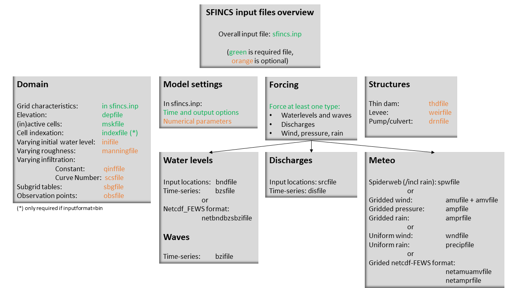

Input parameters
=====

Different parameters for model input and output of SFINCS can be changed in **sfincs.inp**, see below. 
    
Parameters for model input
-----

	mmax
	  :description:		Number of grid cells in x-direction
	  :units:		-
	  :default:		0
	  :min:			1
	  :max:			Inf (recommended is to limit the total number of active cells to max 3 million)
	nmax
	  :description:		Number of grid cells in y-direction
	  :units:		-
	  :default:		0
	  :min:			1
	  :max:			Inf (recommended is to limit the total number of active cells to max 3 million)	  
	dx
	  :description:		Grid size in x-direction
	  :units:		m
	  :default:		0
	  :min:			1.0e-3
	  :max:			Inf (recommended is a maximum grid size of 1000 meters)
	dy
	  :description:		Grid size in y-direction
	  :units:		m
	  :default:		0
	  :min:			1.0e-3
	  :max:			Inf (recommended is a maximum grid size of 1000 meters)	  
	x0
	  :description:		X-coordinate of first grid cell corner (1,1), thus not center of grid cell, in projected UTM zone.
	  :units:		m in projected UTM zone
	  :default:		0
	  :min:			0
	  :max:			Inf 
	y0
	  :description:		Y-coordinate of first grid cell corner (1,1), thus not center of grid cell, in projected UTM zone.
	  :units:		m in projected UTM zone
	  :default:		0
	  :min:			0
	  :max:			Inf 	  
	rotation
	  :description:		Rotation of the grid in degrees from the x-axis (east) in anti-clockwise direction
	  :units:		degrees
	  :default:		0
	  :min:			0
	  :max:			359.999 	  
	advection
	  :description:		Setting for advection. Releases after Cauberg: 0 for no advection scheme (SFINCS-LIE), 1 for advection scheme on (default, SFINCS-SSWE). This replaces the old obsolete differentation between 1D part of advection (advection=1) and 2D part (advection=2).
	  :units:		-
	  :default:		1
	  :min:			0
	  :max:			1
	advection_scheme	
	  :description:		Advection scheme selection, new scheme is 'upw1', default. Original implementation from Leijnse et al. (2021) can be selected as 'advection_scheme = original' for backwards compatability. NOTE - from SFINCS 2024.01 release onwards.
	  :units:		-	
	  :default:		upw1	
	  :min:			upw1	
	  :max:			original	  
	advlim
	  :description:		Limit advection term (when advection > 0) such that horizontal acceleration due to advection does not exceed advlim (default 1.0 m/s2, so limiter turned on by default
	  :units:		m/s2
	  :default:		1.0 - updated from SFINCS v2.2.0 onwards
	  :min:			0
	  :max:			9999  
	alpha	
	  :description:		Numerical time step reduction for CFL-condition. Decrease for additional numerical stability, minimum value is 0.1 and maximum is 0.75.
	  :units:		-	
	  :default:		0.5		
	  :min:			0.1 (recommended)	
	  :max:			0.75 (recommended)		
	friction2d	
	  :description:		Option to select to include 2D component for determining friction term as well: friction2d - true, default. Original implementation from Leijnse et al. (2021) can be selected as 'friction2d = false' for backwards compatability. NOTE - from SFINCS 2024.01 release onwards.
	  :units:		-	
	  :default:		true		
	  :min:			false	
	  :max:			true	
	huthresh	
	  :description:		Minimum flow depth limiter.
	  :units:		m
	  :default:		0.05
	  :min:			0.001 (recommended)
	  :max:			0.1 (recommended)	  
	theta
	  :description:		Numerical smoothing factor in momentum equation. Default of 1.0 means no smoothing.
	  :units:		-
	  :default:		1.0
	  :min:			0.8
	  :max:			1.0
	hmin_cfl - added from SFINCS v2.2.0 onwards	
	  :description:		Minimum water depth to determine maximum timestep using CFL-conditions. Possibility to lower the maximum timestep for increased stability by putting a larger values than the deafult of 0.1 m (as was default before became user option).
	  :units:		m	
	  :default:		0.1		
	  :min:			0.0001	
	  :max:			9999.9	  	  
	baro
	  :description:		Turns on the atmospheric pressure term in the momentum equation (baro = 1, default). If set to 0, all pressure input from either ampfile, netampfile, spwfile or netspwfile is ignored.
	  :units:		-
	  :default:		1
	  :min:			0
	  :max:			1
	viscosity
	  :description:		Turns on the viscosity term in the momentum equation (viscosity = 1), advised to combine with theta = 1.0.
	  :units:		-
	  :default:		1
	  :min:			0
	  :max:			1
	nuviscdim
	  :description:		Depricated after Cauberg release of SFINCS.
	  :units:		-  
	nuvisc
	  :description:		Viscosity coefficient 'per meter of grid cell length', used if 'viscosity=1' and multiplied internally with the grid cell size (per quadtree level in quadtree mesh mode).
	  :units:		-
	  :default:		0.01
	  :min:			0.0
	  :max:			Inf	  	  	  
	coriolis
	  :description: Turns on the Coriolis term in the momentum equation, by default turned on (coriolis = True). For projected coordinate system, if latitude is not provided (default, latitude = 0.0), coriolis is still turned off.
	  :units:		logical
	  :default:		True
	  :min:			False
	  :max:			True
	zsini
	  :description:		Initial water level in entire domain - where above bed level.
	  :units:		m above reference level
	  :default:		0
	  :min:			-Inf
	  :max:			Inf
	qinf
	  :description:		Infiltration rate, spatially uniform and constant in time. Specify in +mm/hr.
	  :units:		mm/hr
	  :default:		0
	  :min:			0
	  :max:			100  
	qinf_zmin
	  :description:		Minimum elevation level above for what cells the spatially uniform, constant in time infiltration rate 'qinf' is added.
	  :units:		m above reference level
	  :default:		0
	  :min:			-100
	  :max:			100  	  
	sfacinf
	  :description:		Curve Number infiltration initial abstraction or the amount of water before runoff, such as infiltration, or rainfall interception by vegetation. Default = 0.2.
	  :units:		-
	  :default:		0.2
	  :min:			0
	  :max:			1  		  
	manning
	  :description:		Uniform manning roughness, specify in s/m^(1/3).
	  :units:		s/m^(1/3)
	  :default:		0.04
	  :min:			0
	  :max:			0.1 (advised)  	
	rgh_lev_land
	  :description:		Elevation level to distinguish land and sea roughness (when using 'manning_land' and 'manning_sea').
	  :units:		m above reference level
	  :default:		0
	  :min:			-Inf
	  :max:			Inf  		  
	manning_land
	  :description:		Varying manning roughness based on elevation (above 'rgh_level_land', overules uniform 'manning', specify in s/m^(1/3).
	  :units:		s/m^(1/3)
	  :default:		-999 (=not used)
	  :min:			0
	  :max:			0.1 (advised)    		  
	manning_sea
	  :description:		Varying manning roughness based on elevation (below 'rgh_level_land', overules uniform 'manning', specify in s/m^(1/3).
	  :units:		s/m^(1/3)
	  :default:		-999 (=not used)
	  :min:			0
	  :max:			0.1 (advised)
	ampr_block        
	  :description:		Keyword controlling whether the input precipitation rate for 2D precipitation input fields is kept constant for the duration of the input time interval (block interpolation, ampr_block = 1, default), or whether it is interpolated linearly in time (ampr_block = 0).
	  :units:		-
	  :default:		1
	  :min:			0
	  :max:			1	      	  
	  
More parameters for model input (only for advanced users)
-----

	bndtype        
	  :description:		Boundary type for interpretation of 'sfincs.bzs' time-series. bndtype=1 is for water levels, old types 2&3 have been removed from SFINCS v2.0.2 onwards.
	  :units:		-
	  :default:		1
	  :min:			1
	  :max:			1
	rhoa
	  :description:		Density of the air
	  :units:		kg/m3
	  :default:		1.25
	  :min:			-
	  :max:			-
	rhow
	  :description:		Density of the water
	  :units:		kg/m3
	  :default:		1024
	  :min:			-
	  :max:			-
	stopdepth - removed from SFINCS v2.1.1 Dollerup onwards, replaced by 'uvmax'
	  :description:		Water depth based on which the minimal time step is determined below which the simulation is classified as unstable and stopped.
	  :units:		m
	  :default:		100
	  :min:			0
	  :max:			Inf	  
	wiggle_suppression
	  :description:		If the acceleration of water level in cell nm is large and positive and in nmu large and negative, or vice versa, apply limiter to the flux. Only for subgrid mode.
	  :units:		logical
	  :default:		True - updated from SFINCS v2.2.0 onwards
	  :min:			False
	  :max:			True
	  :limitation:	Only for subgrid mode
	uvlim - added from SFINCS v2.2.0 onwards
	  :description:		Limit flux velocity (default 10 m/s)
	  :units:		m/s
	  :default:		10
	  :min:			0
	  :max:			9999	  	  
	uvmax - added from SFINCS v2.2.0 onwards, replaces 'stopdepth'
	  :description:		Maximum flux velocity (default 1000 m/s), used to determine minimum timestep, below which simulation is classified as unstable and stopped.
	  :units:		m/s
	  :default:		1000
	  :min:			0
	  :max:			9999	
	slopelim - added from SFINCS v2.2.0 onwards
	  :description:		Apply slope limiter to dzdx (turned off by default, by setting to 9999.9)
	  :units:		-
	  :default:		9999.9
	  :min:			0.0001
	  :max:			9999.9	  	  
	dtmax
	  :description:		Maximum allowed internal timestep.
	  :units:		s
	  :default:		60
	  :min:			1.0e-3
	  :max:			Inf
	dtmin
	  :description:		Minimum allowed internal timestep.
	  :units:		s
	  :default:		1.0e-3
	  :min:			1.0e-3
	  :max:			Inf	  
	tspinup
	  :description:		Duration of spinup period after tstart, where the water level variation at the boundary is dampened, between values in the 'bzsfile' input and the value of 'zsini' (even if using rstfile as initial condition)
	  :units:		s
	  :default:		0
	  :min:			0
	  :max:			Inf
	spinup_meteo
	  :description:		Option to also apply spinup to the meteo forcing, default is off (0)
	  :units:		0
	  :default:		0
	  :min:			0
	  :max:			1	
	utmzone
	  :description:		Option to convert the coordinates of a spiderweb with lat&lon coordinates in degrees to the x&y coordinates in meters of the UTM zone of your SFINCS model grid, 'utmzone=16N' (northern hemisphere) of 'utmzone=36S' (southern hemisphere) in sfincs.inp, default is off (nil).
	  :units:		-
	  :default:		nil
	  :min:			-
	  :max:			-
	h73table
	  :description:		Option to use lookup table to calculate nonlinear term h^(7/3) in momentum equation, depending on model schematisation can lead to ~0-30% speedup of model, default is off (0)
	  :units:		logical
	  :default:		0
	  :min:			0
	  :max:			1		    
	structure_relax
	  :description:		Structure_relax in seconds gives ratio between new and old discharge (default 10s), as relaxation factor
	  :units:		s
	  :default:		10
	  :min:			1
	  :max:			86400	  
	  
	**Drag coefficients:**
	
	cdnrb
	  :description:		Number of specified break points
	  :units:		-
	  :default:		3
	  :min:			2
	  :max:			-	
	cdwnd	  
	  :description:		Wind speed break points (including 0)
	  :units:		-
	  :default:		0  28  50
	  :min:			2 values
	  :max:			-
	cdval
	  :description:		Drag coefficient break points
	  :units:		-
	  :default:		0.001 0.0025 0.0015
	  :min:			2 values
	  :max:			-	  
	
Different parameters influencing the given output by SFINCS can be changed, see below. 

Parameters for model output
-----

	tref
	  :description:		Reference date in 'yyyymmdd HHMMSS'
	  :units:		-
	  :default:		20000101 000000
	tstart
	  :description:		Start date in 'yyyymmdd HHMMSS'
	  :units:		-	
	  :default:		20000101 000000				  
	tstop
	  :description:		Stop date in 'yyyymmdd HHMMSS'
	  :units:		m
	  :default:		20000101 000000
	trstout
	  :description:		Specific time in seconds since 'tref' for restart file output being written away, turned of by default.
	  :units:		s
	  :default:		-999.0	  	  
	dtout
	  :description:		Spatial map output interval
	  :units:		s
	  :default:		0
	dthisout
	  :description:		Observation points output interval
	  :units:		s
	  :default:		600
	dtmaxout
	  :description:		Maximum map output interval. If not specified, the maximum over the entire simulation is calculated. If no output is wanted, specify 'dtmaxout = 0'.
	  :units:		s
	  :default:		9999999
	  :min:			0
	  :max:			'tstop - start in seconds'  
	dtrstout
	  :description:		Restart file output interval, turned of by default.
	  :units:		s
	  :default:		0	  	  
	dtwnd
	  :description:		Time-interval on which spatially varying meteo conditions (spiderweb, precipitation, pressure and wind) are updated from file (<v2.0.0 was only wind). When specifying input 2D fields on a finer resolution than 'dtwnd' (default 30 minutes), this value should be put smaller.
	  :units:		s
	  :default:		1800
	outputformat
	  :description:		Choice whether the SFINCS model output is given in binary 'bin', ascii 'asc' or netcdf files 'net' (default). In case of netcdf output, global output is given in 'sfincs_map.nc', point output in 'sfincs_his.nc' in case observation points are specified.
	  :units:		-
	  :default:		net
	outputformat_map
	  :description:		Choice whether the SFINCS model map output is given in binary 'bin', ascii 'asc' or netcdf files 'net' (default is the setting of 'outputformat', which is 'net').
	  :units:		-
	  :default:		net
	outputformat_his
	  :description:		Choice whether the SFINCS model his output is given in binary 'bin', ascii 'asc' or netcdf files 'net' (default is the setting of 'outputformat', which is 'net').
	  :units:		-
	  :default:		net
	nc_deflate_level
	  :description:		Netcdf deflate level
	  :units:		-
	  :default:		2
	twet_threshold
	  :description:		Threshold value of water depth to count cell as flooded for keeping track of wet cells with storetwet = 1
	  :units:		m
	  :default:		0.01	  
	storetwet
	  :description:		Flag to turn on writing away duration that a cell was wet during simulation (storetwet = 1)
	  :units:		-
	  :default:		0	  
	storevel
	  :description:		Flag to turn on writing away velocities on 'dtout' interval during simulation (storevel = 1)
	  :units:		-
	  :default:		0	
	storevelmax
	  :description:		Flag to turn on writing away maximum velocities on 'dtmaxout' interval during simulation (storevelmax = 1)
	  :units:		-
	  :default:		0	
	storefluxmax
	  :description:		Flag to turn on writing away maximum flux on 'dtmaxout' interval during simulation (storefluxmax = 1)
	  :units:		-
	  :default:		0		  
	storecumprcp
	  :description:		Flag to turn on writing away cumulative precipitation on 'dtmaxout' interval during simulation (storecumprcp = 1)
	  :units:		-
	  :default:		0		
	storehsubgrid
	  :description:		Flag to turn on writing away 'hmax' maximum water depth estimate (zsmax - z_zmin) for subgrid mode on 'dtmaxout' interval during simulation (storehsubgrid = 1) 
	                    NOTE - this could be perceived as an overestimation of the flooding, downscaling your floodmap to the subgrid pixel resolution using HydroMT_SFINCS function is highly recommended.
	  :units:		-
	  :default:		0		    	 
	storehmean
	  :description:		Flag to turn on writing away 'hmax' as estimated mean water depth in subgrid cell for subgrid mode on 'dtmaxout' interval during simulation (storehmean = 1)
	  					NOTE - only used if subgrid model, and if storehsubgrid = 1
	  :units:		logical
	  :default:		0		   
	storeqdrain
	  :description:		Flag to turn on writing away drainage discharge during simulation (storeqdrain = 1)
	  :units:		-
	  :default:		0	
	storezvolume
	  :description:		Flag to turn on writing away water volumes for the subgrid mode during simulation (storezvolume = 1)
	  :units:		-
	  :default:		0	
	storestoragevolume
	  :description:		Flag to turn on writing away storage volumes for the subgrid mode during simulation (storestoragevolume = 1)
	  :units:		-
	  :default:		0		  	  
	storemeteo
	  :description:		Flag to turn on writing away meteo input data during simulation (storemeteo = 1)
	  :units:		-
	  :default:		0	
	storemaxwind
	  :description:		Flag to turn on writing away maximum wind speed during simulation (storemaxwind = 1)
	  :units:		-
	  :default:		0
	storetzsmax
	  :description:		Flag to turn on writing away the time stamp that the maximum water surface elevation during simulation occured (storetzsmax = 1). Only if zsmax output is saved (dtmaxout > 0).
	  :units:		-
	  :default:		0	  
	debug
	  :description:		Flag to turn on writing away every timestep to output as debug mode (debug = 1)
	  :units:		-
	  :default:		0	
	timestep_diagnostics
	  :description:		Flag to write timestep limiter diagnostics to csv files (timestep_diagnostics = 1). Writes `timestep_diagnostics.csv` during the run and `timestep_diagnostics_domain.csv` at the end of the run. Reason codes: 0=wave-speed limited, 1=velocity limited, 2=dtmax cap.
	  :units:		-
	  :default:		0
	  :min:			0
	  :max:			1
	dt_timestep_diagnostics
	  :description:		Write interval (in seconds) for `timestep_diagnostics.csv`; set to 0 to write every timestep.
	  :units:		s
	  :default:		0
	  :min:			0
	percentage_done
	  :description:		Setting of how frequent to show progress of SFINCS in terms of % and time remaining, default = 5%
	  :units:		integer
	  :default:		5	
	  :min:			1
	  :max:			100		  	
Input files
=====	 

SFINCS consists of many different input files, this overview gives a description, whether they are required or not, unit and format (bin = binary, asc = ascii and net = netcdf).

   Overview of input file of SFINCS with indication whther they are required or not	
	

Domain
-----

	sfincs.inp
	  :description:		General input file of SFINCS describing all model settings, the domain, forcing and structures.
	  :required:		yes
	  :format:		asc	 
	depfile = sfincs.dep
	  :description:		Elevation (bathymetry and topography) at grid cell centres above a reference level. 
	  :units:		m above reference level
	  :required:		yes in case of regular mode, no in case of subgrid mode
	  :format:		bin or asc
	mskfile = sfincs.msk
	  :description:		This mask indicates for every cell whether it is an inactive cell (msk=0), active cell (msk=1), boundary cell (msk=2) or outflow boundary cell msk=3).
	  :units:		-
	  :required:		yes	  
	  :format:		bin or asc
	indexfile = sfincs.ind
	  :description:		File describing the indices of active grid cells within the overall grid. Not used by SFINCS with ascii input.
	  :units:		-
	  :required:		Only if 'inputformat = bin'
	  :format:		bin	  
	mskfile = sfincs.msk
	  :description:		This mask indicates for every cell whether it is an inactive cell (msk=0), active cell (msk=1), water level boundary cell (msk=2) or outflow boundary cell msk=3).
	  :units:		-
	  :required:		yes	  
	  :format:		bin or asc	  
	manningfile = sfincs.man
	  :description:		For spatially varying friction values per cell use the manningfile option, with the same grid based input as the depfile using a binary file. Not used by SFINCS in subgrid mode.
	  :units:		s/m^(1/3)
	  :required:		no in case of regular mode, ignored in case of subgrid mode	  
	  :format:		bin	 
	qinffile = sfincs.qinf
	  :description:		For spatially varying constant in time infiltration values per cell use the qinffile option, with the same grid based input as the depfile using a binary file.
	  :units:		mm/hr
	  :required:		no	  
	  :format:		bin	  
	scsfile = sfincs.scs
	  :description:		For spatially varying infiltration values per cell using the Curve Number method A (without recovery) use the scsfile option, with the same grid based input as the depfile using a binary file.
	  :units:		-
	  :required:		no	  
	  :format:		bin	  	  
	smaxfile = sfincs.smax
	  :description:		For spatially varying infiltration values per cell using the Curve Number method B (with recovery) provide the smaxfile (as well as the sefffile and ksfile) as maximum soil moisture storage capacity in m, with the same grid based input as the depfile using a binary file.
	  :units:		m
	  :required:		no	  
	  :format:		bin	  	
	sefffile = sfincs.seff
	  :description:		For spatially varying infiltration values per cell using the Curve Number method B (with recovery) provide the sefffile (as well as the smaxfile and ksfile) as soil moisture storage capacity at the start in m, with the same grid based input as the depfile using a binary file.
	  :units:		m
	  :required:		no	  
	  :format:		bin	  
	ksfile = sfincs.ks
	  :description:		For spatially varying infiltration values per cell using the Curve Number method B (with recovery) provide the ksfile (as well as the smaxfile and sefffile) as saturated hydraulic conductivity in mm/hr, with the same grid based input as the depfile using a binary file.
	  :description:		For spatially varying infiltration values per cell using the Green & Ampt method (with recovery) provide the ksfile (as well as the sigmafile and psifile) as saturated hydraulic conductivity in mm/hr, with the same grid based input as the depfile using a binary file.
	  :units:		mm/hr
	  :required:		no	  
	  :format:		bin	  
	sigmafile = sfincs.sigma
	  :description:		For spatially varying infiltration values per cell using the Green & Ampt method (with recovery) provide the sigmafile (as well as the psifile and ksfile) as suction head at the wetting front in mm, with the same grid based input as the depfile using a binary file.
	  :units:		mm
	  :required:		no	  
	  :format:		bin	 
	psifile = sfincs.psi
	  :description:		For spatially varying infiltration values per cell using the Green & Ampt method (with recovery) provide the psifile (as well as the sigmafile and ksfile) as soil moisture deficit in [-], with the same grid based input as the depfile using a binary file.
	  :units:		-
	  :required:		no	  
	  :format:		bin	 
	f0file = sfincs.f0
	  :description:		For spatially varying infiltration values per cell using the Horton method (with recovery) provide the f0file (as well as the fcfile and kdfile) as maximum (Initial) Infiltration Capacity in mm/hr, with the same grid based input as the depfile using a binary file.
	  :units:		mm/hr
	  :required:		no	  
	  :format:		bin	
	fcfile = sfincs.fc
	  :description:		For spatially varying infiltration values per cell using the Horton method (with recovery) provide the fcfile (as well as the f0file and kdfile) as Minimum (Asymptotic) Infiltration Rate in mm/hr, with the same grid based input as the depfile using a binary file.
	  :units:		mm/hr
	  :required:		no	  
	  :format:		bin	 	
	kdfile = sfincs.kd
	  :description:		For spatially varying infiltration values per cell using the Horton method (with recovery) provide the kdfile (as well as the f0file and fcfile) as empirical constant (hr-1) of decay, with the same grid based input as the depfile using a binary file.
	  :units:		hr-1
	  :required:		no	  
	  :format:		bin	 		  	   	  
	sbgfile = sfincs.sbg
	  :description:		File containing subgrid tables, only needed by SFINCS if you want to run your model in the subgrid mode. Recommended netcdf file input option available from SFINCS 2024.01 release onwards as in Van Ormondt et al. 2024, binary file option still possible for backwards compatability.
	  :units:		-
	  :required:		Only for running SFINCS in subgrid mode	  
	  :format:		new is netcdf, old is binary		  
	obsfile = sfincs.obs
	  :description:		To get output time-series at individual point locations, observations points have to be specified.
	  :units:		m in projected UTM zone
	  :required:		no (only if point output is wanted)
	  :format:		asc		  
	crsfile = sfincs.crs
	  :description:		To get output time-series of discharge through a cross-section, cross_sections have to be specified.
	  :units:		m in projected UTM zone
	  :required:		no (only if cross-section output is wanted)
	  :format:		tekal
	volfile = sfincs.vol
	  :description:		Green infrastructure spatially varying storage volume in m3 per grid cell, with the same grid based input as the depfile using a **binary file**.
	  :units:		m3
	  :required:		no
	  :format:		**bin**
	inifile = sfincs.ini
	  :description:		For spatially varying initial water level per cell, with the same grid based input as the depfile using a **binary file**. In older version this was an ascii file still, not from official release v2.0.0 onwards!
	  :units:		m above reference level
	  :required:		no
	  :format:		**bin**		
	rstfile = sfincs.rst
	  :description:		More advanced restartfile that can also contain fluxes and velocities. As produced by SFINCS if dtrstout > 0 OR trstout > 0. Type of restart - 1: zs, qx, qy, umean and vmean  - 2: zs, qx, qy - 3: zs
	  :units:		-
	  :required:		no 
	  :format:		bin	

Forcing - Water levels and waves
-----

	bndfile = sfincs.bnd
	  :description:		To specify water-level time-series to the boundary cells (msk=2), first the input locations have to be specified in 'sfincs.bnd'.
	  :units:		m in projected UTM zone	  
	  :required:		Only when specifying water levels and waves.
	  :format:		asc	 
	bzsfile = sfincs.bzs
	  :description:		In the file 'sfincs.bzs' the (slowly varying) water level time-series are specified per input location. 
	  :units:		m above reference level
	  :required:		Only when specifying water levels.
	  :format:		asc	 	
	bzifile = sfincs.bzi
	  :description:		Tn the file 'sfincs.bzi' the quickly varying water level time-series due to incoming waves are specified per input location. Do note that the input timestep should be the same in both the bzs and bzi files!
	  :units:		m around mean water level of bzsfile
	  :required:		Only when specifying waves.
	  :format:		asc		
	netbndbzsbzifile = sfincs_netbndbzsbzifile.nc
	  :description:		To specify all bnd, bzs (and bzi) input in 1 FEWS compatible netcdf input file. Specify either the netcdf version or ascii, not both.
	  :units:		m in projected UTM zone, m above reference level & m around mean water level of bzsfile
	  :required:		Only when specifying water levels and waves using netcdf input file.
	  :format:		net	 
	  
Forcing - Discharges
-----

	srcfile = sfincs.src
	  :description:		To specify discharge points, first the input locations have to be specified in 'sfincs.src'.
	  :units:		m in projected UTM zone
	  :required:		Only when specifying discharges.
	  :format:		asc	 
	disfile = sfincs.dis
	  :description:		In the file 'sfincs.dis' the discharge time-series are specified per input location. 
	  :units:		m^3/s
	  :required:		Only when specifying discharges.
	  :format:		asc	 	
	netsrcdisfile = sfincs_netsrcdisfile.nc
	  :description:		To specify all src & dis input in 1 FEWS compatible netcdf input file. Specify either the netcdf version or ascii, not both.
	  :units:		m in projected UTM zone, discharge in m3/s
	  :required:		Only when specifying discharges.
	  :format:		net	 

Forcing - Meteo
-----

	spwfile = sfincs.spw
	  :description:		Spiderweb file including wind speed, direction, pressure (and possibly rainfall).
	  :units:		coordinates: m in projected UTM zone, data: m/s, wind_from_direction in degrees, p_drop in Pa (and precipitation in mm/hr).
	  :required:		no
	  :format:		asc	 
	netspwfile = spiderweb.nc
	  :description:		Spiderweb file including wind speed, direction, pressure (and possibly rainfall).
	  :units:		coordinates: m in projected UTM zone, data: m/s, wind_from_direction in degrees, p_drop in Pa (and precipitation in mm/hr).
	  :required:		no
	  :format:		netcdf	 	  
	amufile = sfincs.amu
	  :description:		Delft3D-meteo ascii type input of wind speed in x-direction.
	  :units:		coordinates: m in projected UTM zone, data: m/s
	  :required:		no
	  :format:		asc	 	
	amvfile = sfincs.amv
	  :description:		Delft3D-meteo ascii type input of wind speed in y-direction.
	  :units:		coordinates: m in projected UTM zone, data: m/s
	  :required:		no
	  :format:		asc	 	  
	ampfile = sfincs.amp
	  :description:		Delft3D-meteo ascii type input of atmospheric pressure.
	  :units:		coordinates: m in projected UTM zone, data: Pa
	  :required:		no
	  :format:		asc
	amprfile = sfincs.ampr
	  :description:		Delft3D-meteo ascii type input of precipitation intensity.
	  :units:		coordinates: m in projected UTM zone, data: mm/hr
	  :required:		no
	  :format:		asc	 
	wndfile = sfincs.wnd
	  :description:		Spatially uniform wind 
	  :units:		wind speed in m/s, wind direction in nautical from where the wind is coming
	  :required:		no
	  :format:		asc	 	 
	precipfile = sfincs.prcp
	  :description:		Spatially uniform precipitation
	  :units:		mm/hr
	  :required:		no
	  :format:		asc	
	netamuamvfile = sfincs_netamuamvfile.nc
	  :description:		FEWS type netcdf meteo input with wind speed in both x-&y-direction in m/s.
	  :units:		coordinates: m in projected UTM zone, data: m/s
	  :required:		no
	  :format:		net	 	
	netampfile = sfincs_netampfile.nc
	  :description:		FEWS type netcdf meteo input with atmospheric pressure in Pa.
	  :units:		coordinates: m in projected UTM zone, data: Pa
	  :required:		no
	  :format:		net	 		
	netamprfile = sfincs_netamprfile.nc
	  :description:		FEWS type netcdf meteo input with precipitation in mm/hr.
	  :units:		coordinates: m in projected UTM zone, data: mm/hr
	  :required:		no
	  :format:		net	 			    
	  
Structures
-----

	thdfile = sfincs.thd
	  :description:		With a thin dam flow through certain grid cells is completely blocked (i.e. an infinitely high wall).
	  :units:		coordinates: m in projected UTM zone.
	  :required:		no
	  :format:		asc	 
	weirfile = sfincs.weir
	  :description:		Weirs are in principle the same as a thin dam, but then with a certain height (levee).
	  :units:		coordinates: m in projected UTM zone, elevation in m above reference level, weir formula coefficient in [-]
	  :required:		no
	  :format:		asc	 
	drnfile = sfincs.drn
	  :description:		Drainage pumps, culverts and check valves are both specified using the same format file, put with a different indication of the type (type=1 is drainage pump, type=2 is culvert and type=3 is check valve).
	  :units:		coordinates: m in projected UTM zone, discharges in m^3/s.
	  :required:		no
	  :format:		asc	 
	  
